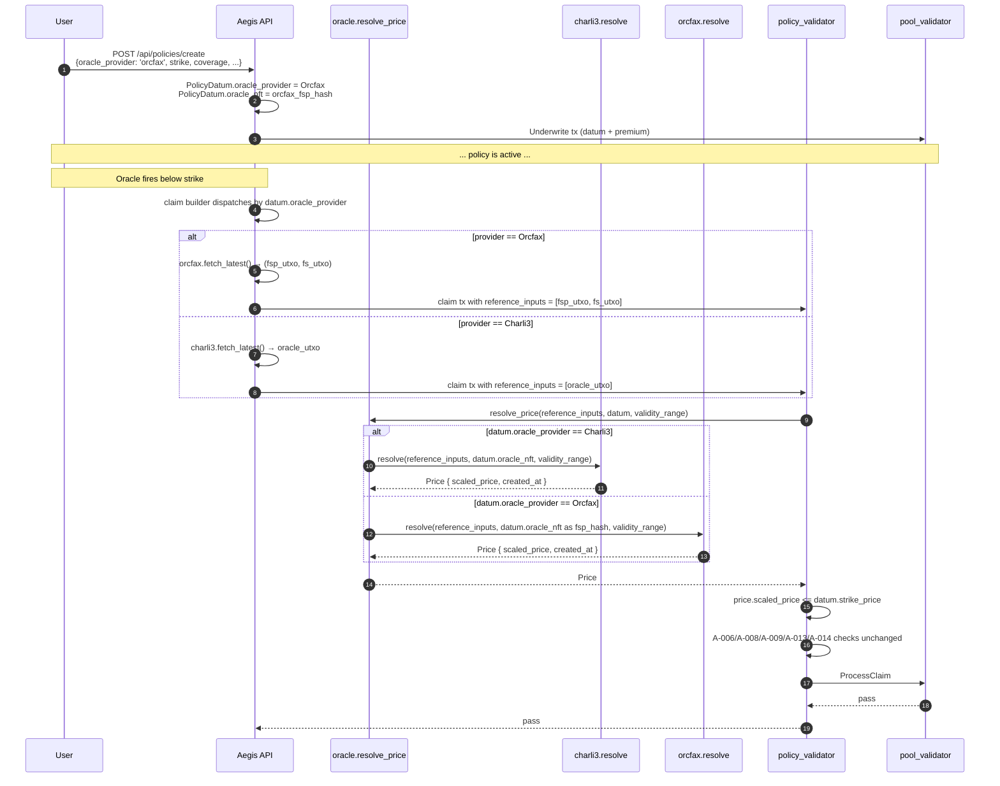

# Aegis — Orcfax as Redundant Secondary Oracle

**Status:** Design scope, not implementation.
**Author:** PACT Architect
**Date:** 2026-04-30
**Audience:** Plutus + TypeScript + Python engineers building this.
**Pre-reqs read:** `contracts/lib/aegis/types.ak`, `contracts/lib/aegis/oracle.ak`, `contracts/validators/policy.ak`, `docs/ARCHITECTURE.md`, `docs/audit/SECURITY_AUDIT_REPORT.md` (esp. A-012, A-016), `docs/audit/TREASURY_DONATION_SCOPE.md`, `docs/audit/RELAY_PRESIGNED_AUTH_SCOPE.md`, `api/oracle.py`.

---

## 0. Goal in one sentence

Add Orcfax as a redundant secondary ADA/USD oracle alongside Charli3, selectable per-policy at creation time, so a single oracle outage, deprecation, or governance breakdown cannot brick the protocol — without giving up the cryptographic trust handshake from A-016.

Charli3 stays primary. Orcfax is the failover. We do not pivot.

---

## 1. What Orcfax actually is

### 1.1 Architecture

Orcfax is a Cardano-only "second-generation" oracle (V1 protocol since mid-2024). It is a **decentralizing-but-currently-federated push oracle** with three architectural pieces:

1. **Validator nodes** (today federated, transitioning via an Incentivized Testnet) collect from a minimum of three independent CEX/DEX sources, normalize, aggregate via a documented method (median for CEX feeds, weighted-mean for DEX), and produce a signed Fact Statement.
2. **Publish dApp** (`github.com/orcfax/publish`, made public 2026-03-17, audited by Tx Pipe) writes the Fact Statement on-chain as a UTxO carrying an FS NFT, locking the price datum at the FS validator address.
3. **Consumers** read the price by attaching the FS UTxO as a **reference input** and parsing its inline datum.

Decentralization status as of 2026-04: 100 validator-license NFTs minted (sold out), 57 active validators in ITN Phase 1 (Dec 2024 – Jul 2025). Phase 2 (full on-chain consensus + permissionless publication) was on the roadmap but not yet shipped to mainnet. **Today, the federation still controls publication.** This is comparable in trust to Charli3's pre-ODV state.

Sources: <https://docs.orcfax.io/solution-overview>, <https://docs.orcfax.io/itn-overview>, <https://docs.orcfax.io/roadmap>, <https://medium.com/@orcfax/orcfax-itn-from-phase-1-cex-collection-to-phase-2-on-chain-data-3427ac95ae8d>.

### 1.2 Network presence

| Network | Live? | Feed dir |
|---|---|---|
| **Mainnet** | **Yes**, `feeds/mainnet/cer-feeds.json` ([source](https://github.com/orcfax/cer-feeds/blob/main/feeds/mainnet/cer-feeds.json)) | 23 active CER feeds, ADA-USD interval=3600s, deviation=1%, source=cex, calculation=median, status=sponsored |
| **Preview** | **Yes**, `feeds/preview/cer-feeds.json` | ADA-USD plus BTC-USD and ETH-USD CEX feeds with the same interval/deviation |
| **Preprod** | **NO. There is no `feeds/preprod/` directory.** Verified by 404 on `https://raw.githubusercontent.com/orcfax/cer-feeds/main/feeds/preprod/cer-feeds.json`. | — |

This is the single most consequential fact in this document and it changes the migration story (see §6).

### 1.3 Feeds offered

23 mainnet feeds at the latest cer-feeds release `2025.10.09.0002`. Notable: `ADA-USD`, `ADA-DJED`, `ADA-iUSD`, `ADA-USDM`, `ADA-USDA`, `BTC-USD` (preview only today), `ETH-USD` (preview only today), plus 17 CNT pairs against ADA. ADA-USD is sourced from three CEXes with median calculation — the methodology Aegis cares about.

### 1.4 Reputation incidents

The 2024-05-15 mainnet feed suspension is real and worth pricing in. Per <https://medium.com/@orcfax/orcfax-feed-suspension-and-protocol-upgrade-a45709dafb56>, the V0 Plutus-Chain-Index dependency went unsupported by IOG and the V0 protocol was retired without a hot-swap to V1. One production user (Cerra) was affected; they had a fallback. **This is exactly the failure-mode Aegis is now insuring itself against.** The V1 redesign is a different protocol with different dependencies, but the precedent argues for redundancy, not single-provider exclusivity.

---

## 2. Orcfax on-chain footprint

### 2.1 Two-layer pointer indirection (FSP → FS)

Unlike Charli3 (single canonical oracle UTxO at one script address with one rotatable NFT), Orcfax uses a two-layer scheme. Both layers must be referenced at consumer-tx time.

```mermaid
flowchart LR
  C[Consumer tx] -->|reference_input| FSP[FactStatementPointer UTxO<br/>at FSP script address<br/>holds NFT under 'fsp_hash' policy<br/>asset_name = #000de140 vali label<br/>InlineDatum = bytes(fs_hash)]
  C -->|reference_input| FS[FactStatement UTxO<br/>at FS script address = fs_hash<br/>holds NFT under same fs_hash policy<br/>asset_name = empty bytestring<br/>InlineDatum = FsDat&lt;Rational&gt;]
  FSP -. points to .-> FS
```

- **FSP** ("FactStatementPointer") is a **stable** UTxO whose datum is an arraybyte holding the *current* `fs_hash`. The FSP script hash is the immutable handle Orcfax publishes for an integrator. If Orcfax rotates the FS validator (protocol upgrade), the FSP is updated to point at the new hash; integrators never have to redeploy.
- **FS** ("FactStatement") is the per-fact UTxO containing the actual price datum. The FS NFT lives under a policy that **equals the FS validator script hash** — i.e., the policy is the validator (a parameterless minting+spending validator with the same script).

This indirection layer is Orcfax's answer to Charli3's "if we rotate the script, every integrator must redeploy" problem (the same problem Aegis hit explicitly in A-016). For Aegis it is a feature: it means the trust handshake we pin is the **FSP hash**, not the FS hash, and so a routine Orcfax upgrade does not strand existing Aegis policies.

Source: <https://docs.orcfax.io/consume>.

### 2.2 Canonical hashes

| Network | Layer | Hash | Source |
|---|---|---|---|
| **Mainnet** | FSP script | `8793893b5dda6a513ba63c80e9d7b2d4f108060c11979bfc7d863ff0` | <https://docs.orcfax.io/consume> ("Policy ID on cexplorer.io" link) |
| **Preview** | FSP script | `0690081bc113f74e04640ea78a87d88abbd2f18831c44c4064524230` | same source ("Script on cexplorer.io" link) |
| **Preprod** | FSP script | **Does not exist.** No preprod deployment. | verified |
| **Mainnet** | FS script (current) | resolved at runtime by reading FSP datum | dynamic — see §2.3 |
| **Mainnet** | example FS NFT policy | `193ee65211bb3...` (truncated as displayed by explorer.orcfax.io) | <https://explorer.orcfax.io/feeds/CER/ADA-USD/facts/289adfa9-9152-403c-b361-ecd0f53e196e> (Dec 2025 fact statement) |

The mainnet FS is dynamic because the FSP can be re-pointed without integrator action. Today's Aegis, by contrast, hardcodes a static script hash (`charli3_oracle_script_hash` const, `types.ak:212`) — Orcfax's design pushes that resolution to runtime by deliberate intent. The on-chain validator must do the FSP→FS resolution every claim.

### 2.3 Token labels

From `lib/orcfax/tokens.ak` ([source](https://github.com/orcfax/orcfax-aiken/blob/main/lib/orcfax/tokens.ak)):

```aiken
pub fn fs() { "" }                        // FS NFT asset name = empty bytestring
pub fn vali_pref() { #"000de140" }        // CIP-67 reference NFT label
pub fn fsp_label() { "" }
pub fn fsp_vali() { #"000de140" }         // FSP NFT asset name (label + empty fsp_label)
pub fn auth_pref() { #"000643b0" }        // CIP-67 user NFT label (used by validator network internals)
```

So an Aegis claim tx must reference two UTxOs: one with `fsp_hash` policy + asset `000de140` (the FSP), and one with `<fs_hash>` policy + empty asset name (the FS). The FS NFT policy ID is `fs_hash` itself (same script for spend and mint).

### 2.4 Datum shape

From `lib/orcfax/types.ak` and `lib/orcfax/rational.ak`:

```aiken
pub type FsDat<t> {
  statement: Statement<t>,
  context: Context,
}
pub type Statement<t> {
  feed_id: ByteArray,    // e.g. b"CER/ADA-USD/" — note trailing slash matters
  created_at: Int,       // POSIX milliseconds
  body: t,
}
pub type Context = Data  // ignored by consumers

pub type Rational {
  num: Int,
  denom: Int,
}
pub type RationalFsDat = FsDat<Rational>
```

`feed_id` example bytes: `#"4345522f4144412d5553442f"` for `"CER/ADA-USD/"` — the trailing `/` is **mandatory** (per `feed_id.ak` test `test_mk_feed_id_a` and the docstring "the trailing slash prevents `ADA-USDM` being a match for `ADA-USD`"). Use `starts_with` rather than equality so the protocol can later append a version suffix (`CER/ADA-USD/3/`) without breaking integrators.

The price is encoded as a rational `num/denom` with arbitrary precision and **no fixed scale**. Example from docs: `54301/1250000000` (which is the wire representation of an ADA-USD ratio — i.e., 1 USD = 54301/1250000000 ADA *or* the inverse, depending on the feed's directionality which is encoded into the feed_id by base/quote ordering). Compare to Charli3's fixed `1e6` scaling encoded as a single int — Orcfax's Rational is more accurate but requires the consumer to decide on scaling.

### 2.5 No expiry field

**There is no `expiry` field on the Orcfax datum.** The only timestamp is `created_at`. Freshness is the consumer's responsibility, enforced by validating that `created_at` falls inside the tx validity range *and* that the validity range is short. Orcfax's recommended pattern (from `lib/orcfax/validity_range.ak` docstring):

```aiken
let (lb, ub) = get_bounds(validity_range)
let thirty_minutes = 30 * 60 * 1000
expect and {
  ub - lb < thirty_minutes,
  lb - created_at < thirty_minutes,
}
```

This is fundamentally different from Charli3, where the oracle datum embeds a publisher-set `expiry` field at key 2 of the GenericData map and `is_oracle_valid(datum, tx_lower)` reduces to `tx_lower <= expiry`. **Migrating freshness semantics is not free** — see §3.

### 2.6 UTxO lifecycle

Orcfax does NOT consume-and-recreate one canonical UTxO. Instead, every fresh fact statement is a new UTxO, and the publisher leaves prior fact-statement UTxOs unspent for ~3h before garbage-collecting them. Anyone with a valid signed statement can also republish. So at any moment there can be multiple FS UTxOs at the FS script address — the consumer picks the freshest by `created_at`. Source: <https://medium.com/@orcfax/the-orcfax-design-handling-time-and-truth-in-an-eutxo-world-ba0ef84db7c0>.

This creates an **off-chain selection step** that does not exist for Charli3: the relay/builder must enumerate FS UTxOs and pick the most recent, then attach exactly that one as a reference input. Pick the wrong one and the validator's freshness bound rejects the tx.

---

## 3. Architectural comparison vs. Charli3

| Dimension | Charli3 ODV | Orcfax V1 |
|---|---|---|
| Trust model | Federated NetworkAdmin contract; ODV pull-aggregation lets node operators consense before publication; canonical UTxO at single script address | Federated publisher; consumer sees a signed Fact Statement; ITN moving toward 100-validator BFT consensus, not yet on mainnet |
| Decentralization (today) | ~5–8 nodes; consensus enforced on-chain via ODV | ~57 ITN validators collecting; publication still federated |
| Datum shape | `OracleDatum { price_data: GenericData { Map<Int,Int> } }` keys 0=price, 1=ts, 2=expiry; price scaled 1e6 | `FsDat<Rational> { Statement { feed_id, created_at, body=Rational{num,denom} }, Context }`; no fixed scaling, no expiry |
| Canonical UTxO | Yes — single ODV oracle UTxO updated by consume-and-recreate | No — each fact statement is its own UTxO; consumer picks freshest |
| On-chain trust handshake | NFT policy + script-hash binding (post A-016) | Two-layer: FSP NFT pinned at deploy, FS hash discovered at runtime via FSP datum |
| Aegis impact of provider rotation | Requires Aegis redeploy (script-hash hardcoded) | None — FSP is stable, FS rotates transparently |
| Freshness semantics | Validator: `tx_lower <= datum.expiry` (publisher-controlled window) | Validator: `created_at` inside tx validity AND validity window short (consumer-controlled) |
| Cost to consumer | None per read; aggregation cost amortized across ODV node operators | None per read; "showcase"/"sponsored"/"paid" tiers exist but per-tx cost is just the extra reference-input bytes |
| Failure mode if publisher dies | Last datum stays valid until its `expiry`, then unusable | Last fact statement stays valid until consumer's `validity_range - created_at` exceeds the configured TTL, then unusable. Symmetric. |
| Past outage | None published | 2024-05-15 mainnet suspension; 2-month gap before V1 |
| Active maintenance | Active | Active (`publish` made public + Tx Pipe audit 2026-03-17) |
| Aegis backend SDK | Custom CBOR parser in `api/oracle.py` (cbor2 + Ogmios) | None official — Orcfax provides Aiken lib but no Python SDK; we'd add a parser ourselves |
| License | Proprietary (Charli3 contracts) | Apache-2.0 across all Orcfax public repos |

The honest summary: **both are federated push oracles in 2026.** Orcfax has a cleaner pointer-indirection design that survives provider rotation without integrator redeploy. Charli3 has more battle-time on Cardano DeFi and an existing presence in Aegis's hot path. They fail in different ways — Orcfax's two-layer indirection means a buggy FSP redeploy could brick all integrators in one step, where Charli3's NFT model lets a stuck NFT be the failure mode. Neither is strictly safer; they are differently failure-correlated, which is exactly the point.

---

## 4. The integration design

### 4.1 The hard constraint

A-016 ("Oracle UTxO trust = NFT only" → fixed by pinning Charli3's script hash at compile time) was the highest-impact audit fix in the post-audit pass. The whole point was that **the trust root for an oracle is the validator script hash, never the NFT alone.** Generalizing that fix across providers means each provider has its own pinned hash, and the validator must accept exactly one provider per consumed policy.

### 4.2 Schema migration to PolicyDatum

We have already had to extend `PolicyDatum` once for each post-audit pass. We are about to extend it again for treasury donation (no — that one is a constant, not a datum field) and once more for the relay pre-signed auth (`auth_commitment: Option<ByteArray>`, see `RELAY_PRESIGNED_AUTH_SCOPE.md`). Stacking three datum changes in three deploys is deploy-script churn. We should bundle.

For Orcfax, **append exactly one field** to `PolicyDatum`:

```aiken
pub type PolicyDatum {
  policy_id, insured, strike_price, coverage_amount, premium_paid,
  start_time, expiry_time, oracle_nft, pool_script_hash, pool_nft,
  auth_commitment,        // post-A-021 (relay)
  // NEW (post-A-022):
  oracle_provider: OracleProvider,
}

pub type OracleProvider {
  Charli3      // existing canonical Charli3 ODV path
  Orcfax       // new Orcfax FSP→FS path
}
```

`OracleProvider` is a sum type (CONSTR_0, CONSTR_1) — minimal CBOR overhead, type-safe at the validator level. The 11th field `auth_commitment` and the new 12th `oracle_provider` are both appended at the end so the positional CBOR encoding for the first 10 fields is preserved.

**Why a sum type and not a free-form `oracle_script_hash: ByteArray`:**

- **Curated provider list at the contract level.** A free-form ByteArray would require a second runtime check ("is this hash in our whitelist?"), either as a hardcoded list (which defeats the point — adding a provider would still need a redeploy) or as a separate registry UTxO (large new audit surface). A sum type variant *is* the whitelist, enforced by Aiken's exhaustivity check.
- **Type-safe parser dispatch.** The validator's `when datum.oracle_provider is { Charli3 -> ... | Orcfax -> ... }` branches each call a provider-specific resolver-and-parser without casting Data through unsafe holes.
- **Off-chain ergonomics.** The Python provider selector at policy-creation time is a one-of-two enum, not a free-text field. Fewer ways to misconfigure.

The trade-off: **adding a third provider in v3** (e.g., Wingriders Time-Weighted Pool oracle, a CIP-0073 standard feed, or an in-house FEAR index) requires another datum-schema rotation. We accept this. The frequency of new oracle providers we'd actually trust enough to onboard is bounded, and each onboarding will deserve its own audit pass anyway. A datum rotation per onboarding is the right cadence.

### 4.3 Generalize `oracle.ak`

We split the current `oracle.ak` into a thin internal interface plus per-provider parsers. The validator's `policy.ak` only ever sees the internal record.

```aiken
// New internal type (not provider-specific, used only inside oracle.ak)
type Price {
  /// Price scaled by 1e6 (matches Aegis's existing `price_scale = 1_000_000`)
  scaled_price: Int,
  /// POSIX ms when the price was published
  created_at: Int,
}
```

```aiken
// Top-level entrypoint that policy.ak calls
pub fn resolve_price(
  reference_inputs: List<Input>,
  policy_datum: PolicyDatum,
  validity_range: Interval<Int>,
) -> Price {
  when policy_datum.oracle_provider is {
    Charli3 -> charli3.resolve(reference_inputs, policy_datum.oracle_nft, validity_range)
    Orcfax  -> orcfax.resolve(reference_inputs, policy_datum.oracle_nft, validity_range)
  }
}
```

Each provider module owns its own freshness check and produces a `Price` for the validator to consume. The validator's branches no longer call `find_oracle_datum` / `is_oracle_valid` directly; they call `resolve_price` once, get a `Price`, and check `price.scaled_price <= datum.strike_price`.

**Why this factoring (Option B from the prompt) wins over the alternatives:**

- **Option A — provider-tagged `OracleDatum` sum type at the validator level.** Forces the validator to know about each provider's CBOR shape. Every parser change rotates the validator hash. Fragile.
- **Option B (recommended) — provider-uniform internal `Price` record at the lib level.** Validator only knows `Price`. Adding a provider rotates the `oracle.ak` lib hash but not the validator binary directly — until the lib is reimported. In Aiken's compilation model, both rotate together in practice, BUT the surface area of *what changes when we add a provider* is small and localized: a new module file plus a new `OracleProvider` variant. The validator's branches don't touch.
- **Option C — parameterize the policy validator over an array of accepted oracle script hashes.** Not viable. The thing Aegis pins is *script hashes*, but Orcfax's FS hash is dynamic at runtime (FSP indirection). A static hash list cannot accommodate Orcfax. The FSP hash is static, but a pure script-hash whitelist doesn't capture the FSP→FS resolution step.

### 4.4 The Charli3 module (extracted, mostly unchanged)

```aiken
// contracts/lib/aegis/oracle/charli3.ak
pub fn resolve(
  reference_inputs: List<Input>,
  oracle_nft_policy: ByteArray,
  validity_range: Interval<Int>,
) -> Price {
  let datum = find_oracle_datum(reference_inputs, oracle_nft_policy)
  let tx_lower = get_lower_bound(validity_range)
  expect is_oracle_valid(datum, tx_lower)
  Price {
    scaled_price: get_oracle_price(datum),
    created_at: get_oracle_timestamp(datum),
  }
}
```

`find_oracle_datum` keeps its current A-016 binding to `charli3_oracle_script_hash`. Existing `OracleDatum`/`PriceData`/`GenericData` types stay where they are.

### 4.5 The Orcfax module (new)

```aiken
// contracts/lib/aegis/oracle/orcfax.ak
use orcfax/feed_id.{starts_with}
use orcfax/types as orcfax_t
use orcfax/rational.{Rational, RationalFsDat}
use orcfax/tokens as orcfax_tokens

const orcfax_fsp_hash_mainnet: ByteArray =
  #"8793893b5dda6a513ba63c80e9d7b2d4f108060c11979bfc7d863ff0"
const orcfax_fsp_hash_preview: ByteArray =
  #"0690081bc113f74e04640ea78a87d88abbd2f18831c44c4064524230"

const ada_usd_feed_id: ByteArray = #"4345522f4144412d5553442f"  // "CER/ADA-USD/"
const max_freshness_ms: Int = 30 * 60 * 1000   // 30 min — matches orcfax-examples/synthetics

pub fn resolve(
  reference_inputs: List<Input>,
  fsp_hash: ByteArray,
  validity_range: Interval<Int>,
) -> Price {
  // 1. Find the FSP UTxO
  expect Some(fsp_input) = reference_inputs |> list.find(
    fn(i) { value.quantity_of(i.output.value, fsp_hash, orcfax_tokens.fsp_vali()) == 1 }
  )
  expect Script(fsp_addr) = fsp_input.output.address.payment_credential
  expect fsp_addr == fsp_hash    // address pinning, mirrors A-016
  expect InlineDatum(fsp_idat) = fsp_input.output.datum
  expect fs_hash: ByteArray = fsp_idat

  // 2. Find the FS UTxO via the dynamic fs_hash
  expect Some(fs_input) = reference_inputs |> list.find(
    fn(i) { value.quantity_of(i.output.value, fs_hash, orcfax_tokens.fs()) == 1 }
  )
  expect Script(fs_addr) = fs_input.output.address.payment_credential
  expect fs_addr == fs_hash      // FS NFT policy == FS validator hash
  expect InlineDatum(fs_idat) = fs_input.output.datum
  expect fs_dat: RationalFsDat = fs_idat

  // 3. Verify feed_id and freshness
  expect fs_dat.statement.feed_id |> starts_with(ada_usd_feed_id)
  let (lb, ub) = get_bounds(validity_range)
  expect ub - lb < max_freshness_ms
  expect lb - fs_dat.statement.created_at < max_freshness_ms
  expect fs_dat.statement.created_at <= ub

  // 4. Convert Rational to scaled-price int
  // ADA-USD direction: feed says "1 ADA = num/denom USD"; downstream Aegis
  // strike_price is "USD * 1e6 per 1 ADA" — so scaled = num * 1e6 / denom.
  // We round-down (matches existing pricing.ak two-stage div discipline).
  let scaled = fs_dat.statement.body.num * 1_000_000 / fs_dat.statement.body.denom

  Price { scaled_price: scaled, created_at: fs_dat.statement.created_at }
}
```

Two policy-datum interpretations to call out explicitly:

- `policy_datum.oracle_nft` is **reused** as the FSP hash for Orcfax-bound policies. This avoids adding a 13th datum field. The off-chain populates it correctly per provider.
- The Orcfax `fs()` asset name is the empty bytestring (`""`), not a fixed CIP-67 label. We do not pin a label byte in the consumer — the fact that the asset name is empty is part of the `orcfax_tokens.fs()` import.

### 4.6 Validator branches: what changes in `policy.ak`

`Claim`, `BatchClaim`, `Cancel` each call `find_oracle_datum` + `get_oracle_price` + `is_oracle_valid` today. After the change, they call `oracle.resolve_price(reference_inputs, datum, validity_range)` once, get a `Price`, and use `price.scaled_price` in `price_below_strike` (Claim/BatchClaim) or `oracle_price > strike` (Cancel). The freshness check moves *inside* `resolve_price`, so the explicit `is_oracle_valid` line at `policy.ak:139` is removed. Net: simpler validator branches, more responsibility in the lib.

### 4.7 BatchClaim — A-012 generalization

The current `batch_oracles_uniform` helper (`policy.ak:50`) folds inputs and asserts every consumed policy carries the same `oracle_nft`. With multiple providers in play, the invariant must extend to **uniform provider AND uniform oracle_nft**, because two policies bound to (Charli3, NFT_x) and (Orcfax, NFT_x) accidentally sharing an `oracle_nft` byte sequence must not be batched even if NFT_x happens to collide.

The simplest fix is to fold over `(oracle_provider, oracle_nft)` as the sentinel pair. CBOR-equality-of-tuples in Aiken collapses to a structural equality check. One-line change to the helper.

This is the only audit invariant whose behavior shifts; A-016 (already pinned) is generalized by construction, A-008 is oracle-orthogonal, A-001/A-005/A-007 are pool-side, A-014/A-015 are time-bound and unaffected.

### 4.8 Off-chain Python module

A new module `D:/aegis/api/orcfax.py` mirrors the shape of the existing `D:/aegis/api/oracle.py` (Charli3). Behavioral spec:

```
class OrcfaxResolver:
    network: 'mainnet' | 'preview'
    fsp_hash: bytes                        # pinned per network
    feed_id_prefix: bytes                  # b"CER/ADA-USD/"

    def fetch_latest(self) -> OrcfaxPrice:
        # 1. Query Blockfrost or Ogmios for the FSP UTxO carrying fsp_hash + fsp_vali asset
        # 2. Read FSP datum -> fs_hash
        # 3. Query for FS UTxOs at fs_hash carrying the empty-name FS NFT
        # 4. Filter to those whose Statement.feed_id starts with feed_id_prefix
        # 5. Sort by created_at desc, take first
        # 6. Return OrcfaxPrice { rational: (num, denom), created_at, fs_utxo_ref, fsp_utxo_ref }

    def to_scaled(self, p: OrcfaxPrice) -> int:
        return p.rational[0] * 1_000_000 // p.rational[1]
```

The resolver's `fetch_latest` returns BOTH UTxO refs because the claim-tx builder needs to attach BOTH as `reference_inputs`. This is the multi-UTxO selection step that doesn't exist for Charli3.

Provider selection at policy creation:

```python
@dataclass
class CreatePolicyParams:
    coverage_amount: int
    strike_price: int
    duration_ms: int
    oracle_provider: Literal['charli3', 'orcfax'] = 'charli3'   # default = Charli3 primary
```

The `policies.py` builder dispatches to the right resolver based on `oracle_provider`, populates `PolicyDatum.oracle_provider` with the right CONSTR tag, and populates `oracle_nft` with the FSP hash (Orcfax) or the Charli3 NFT policy id (Charli3).

For claim, a similar dispatch attaches the right reference inputs:

| Provider | Reference inputs to attach |
|---|---|
| Charli3 | one UTxO at `charli3_oracle_script_hash` carrying `oracle_nft` policy |
| Orcfax | one UTxO at `<fsp_hash>` carrying `fsp_vali` asset + one UTxO at `<dynamic fs_hash>` carrying the FS NFT |

### 4.9 Provider choice UX

Default = Charli3. Orcfax is opt-in at policy creation, exposed in the frontend as a single dropdown ("Oracle source: Charli3 (default) / Orcfax"). This preserves a single-screen UX for the 99% case and gives power users a knob.

The relay (`RELAY_PRESIGNED_AUTH_SCOPE.md`) gains nothing from knowing about providers — its `ClaimWithAuth` path resolves the right oracle reference inputs based on the consumed policy's datum. The auth-commitment payload already includes `oracle_nft`; under this design that field carries the FSP hash for Orcfax-bound policies, and the relay's tick loop must additionally know to attach the FS UTxO (looked up via the FSP datum each tick).

---

## 5. Audit-regression risk

| Finding | Interaction with multi-provider oracle |
|---|---|
| **A-001** payout binding (ProcessClaim) | Untouched. Payout magnitude is a pool-side check, oracle-orthogonal. |
| **A-002 / A-007** strict pool value `==` | Untouched. Oracle does not transit pool. |
| **A-003** LP mint direction | Untouched. |
| **A-004** Underwrite produces correct policy output | Untouched, BUT the produced datum now carries the new `oracle_provider` field. Off-chain must populate it; on-chain validator (Underwrite is in `pool.ak` not `policy.ak`) does not assert anything about its value at create time. Open Q3 below. |
| **A-005** ProcessClaim solvency | Untouched. |
| **A-006** BatchClaim same-insured aggregation | Untouched. Aggregation is at the output side, oracle-orthogonal. |
| **A-008** canonical pool routing via pool_nft | Untouched. |
| **A-009** enterprise-only payout | Untouched. |
| **A-010** in-the-money cancel guard | **Verify carefully.** The guard reads the oracle in the Cancel branch (`policy.ak:323`). Under the new factoring it calls `oracle.resolve_price`. The semantic invariant ("Cancel forbidden when oracle says ITM") is preserved; the implementation route changes. New tests required: `green_a_022_cancel_orcfax_itm_blocks` and `green_a_022_cancel_charli3_itm_blocks`. |
| **A-011** single canonical pool | Untouched. |
| **A-012** uniform oracle in batch | **Generalized.** Now `(oracle_provider, oracle_nft)` must be uniform across the batch. One-line helper change, plus three new tests: a uniform-provider batch passes; a mixed-provider batch fails; a same-provider-different-nft batch fails (as today). |
| **A-013** no untrusted output recipient | Untouched. |
| **A-014** ratio truncation (Open) | Independent. The `num*1e6/denom` Rational→scaled conversion in Orcfax's `resolve` introduces a *new* floor-rounding site, comparable to existing Aegis division. Floor is deliberate — under-reports the price, biasing toward MORE Claim eligibility. The economic analysis matches A-014's own logic: if a finding is "we under-pay LPs by 1 lovelace", that's the safe direction. |
| **A-015** start_time upper bound (Open) | Independent. |
| **A-016** oracle hash pinning (Open in audit, but pre-fixed in code) | **Generalized by construction.** Each provider module pins its own canonical script hash. Charli3 keeps `charli3_oracle_script_hash`. Orcfax pins `orcfax_fsp_hash_mainnet` AND validates that the FS UTxO's address matches the dynamically-resolved `fs_hash` (because FS NFT policy == FS validator hash). The trust handshake is preserved across both providers. |
| **A-017 / A-018** scope notes | Independent. |
| **A-019** diagnostic validator excised | Independent. |
| **A-020** AcceptCancellation | Untouched (does not read oracle; only reads policy_datum.premium_paid). |
| **A-021** treasury donation (post-A-020) | Independent. |
| **A-022** relay pre-signed auth (this scope's twin) | The auth-commitment payload's `oracle_nft` field carries the provider-appropriate identifier (FSP hash for Orcfax, oracle NFT for Charli3). No additional auth field needed. The relay's tick loop must dispatch oracle resolution by provider — a Python concern, not on-chain. |

**Net regression risk: LOW-MEDIUM.** The validator surface that materially expands is `oracle.ak` (now a thin internal record + a per-provider parser layer). The parser is the bug-rich surface — Orcfax's CBOR shape is more complex than Charli3's flat key-value map. **Recommend a dedicated audit pass on `oracle/orcfax.ak` before mainnet.**

### 5.1 New tests required

Add to `contracts/lib/aegis/test_helpers/security_tests.ak`:

- `green_a_022_orcfax_resolve_happy_path`
- `green_a_022_orcfax_wrong_fsp_address_rejected`
- `green_a_022_orcfax_fs_address_mismatch_rejected` (FS UTxO at non-canonical address with right NFT)
- `green_a_022_orcfax_wrong_feed_id_rejected` (e.g., `CER/ADA-USDM/` cannot pass an `ADA-USD/` consumer due to the trailing-slash convention)
- `green_a_022_orcfax_stale_created_at_rejected` (created_at older than 30 min before validity lower)
- `green_a_022_orcfax_wide_validity_range_rejected` (ub - lb > 30 min)
- `green_a_022_orcfax_rational_zero_denom_aborts` (denom=0 → division panics; verify it fails closed, not unsafely)
- `green_a_022_charli3_path_unchanged` (regression test: post-refactor Charli3 still passes the equivalent of the existing oracle tests)
- `green_a_022_batch_mixed_provider_rejected`
- `green_a_022_batch_uniform_orcfax_passes`
- `green_a_022_cancel_orcfax_itm_blocks`
- `green_a_022_cancel_orcfax_otm_passes`

Twelve new tests. Suite goes from ~537 (post-treasury, see TREASURY_DONATION_SCOPE) to ~549.

---

## 6. Migration path

### 6.1 The preprod gap

Orcfax has no preprod deployment. They run on mainnet and preview. Aegis runs on preprod. **This is the central operational issue.**

Three options:

| Option | What it is | Recommended? |
|---|---|---|
| **(a) Aegis adds a preview deployment** alongside preprod | Republish Aegis ref scripts on preview, init a preview pool, and run end-to-end Orcfax tests there. Preprod stays the dev-loop network for Charli3. | **YES, conditionally.** Preview's epoch length and parameter set are close enough to preprod that the validator change is identical; only the deploy configs differ. |
| **(b) Mock an Orcfax FSP/FS pair on preprod** | Build a tiny dApp that mints a fake-FSP NFT, locks a fake datum, and exposes it from a controlled validator address. Pin Aegis's `orcfax_fsp_hash_preprod` to that mock for the dev cycle. Switch to real Orcfax when going to mainnet. | **YES** for fast iteration. The mock's only contract is "match the published Orcfax datum schema bit-for-bit." This is the same approach Orcfax themselves recommend (`orcfax-examples/mock`). |
| **(c) Skip preprod testing and only validate on preview** | Risky. Loses parity with the existing 529-test preprod suite. | **NO.** |

**Recommendation:** do (a) AND (b) — mock on preprod for fast iteration, then republish to preview for an integration smoke test against real Orcfax before mainnet. Mainnet rollout uses real Orcfax mainnet artifacts.

### 6.2 Validator-hash impact

The schema change rotates `pool_validator` (parameterized over policy hash) AND `policy_validator` (datum schema changed) AND any module that imports `oracle.ak`. Specifically:

| Artifact | Status |
|---|---|
| `policy_validator_hash` | NEW (datum schema changed + oracle.ak refactor) |
| `pool_validator_hash` | NEW (cascades from policy hash) |
| `lp_token_policy_hash` | NEW (cascades from pool hash) |
| `pool_nft_policy_id` | NEW (driven by mint script change is unrelated, but we'll re-mint with `AEGIS_POOL_V3` to avoid any name collision) |
| `oracle_nft` field interpretation | **CONTEXTUAL** — for Charli3 policies, same as today; for Orcfax policies, this is the FSP hash |

This is a v6 deploy if we ship Treasury and Relay separately, or v3 (the user's framing) if we bundle. Recommend **bundling Treasury + Relay + Orcfax into a single v6/v3 redeploy**. Three cascading rotations don't help anyone.

### 6.3 Per-network deploy state

Add a new section to `configs/deploy-state.{preprod,preview,mainnet}.json`:

```json
{
  "oracles": {
    "charli3": {
      "script_hash": "221ee21e9607f766e1e1223248f67320014825169a1d98eb34c6f658",
      "ada_usd_nft_policy": "<existing Charli3 ADA/USD NFT policy>"
    },
    "orcfax": {
      "fsp_script_hash": "<network-specific FSP hash>",
      "ada_usd_feed_id_hex": "4345522f4144412d5553442f"
    }
  }
}
```

`preprod` carries `orcfax.fsp_script_hash` of the **mock validator** we deploy. `preview` and `mainnet` carry the real Orcfax FSP hashes from §2.2.

### 6.4 Mainnet rollout

Mainnet was on hold pending audit's open A-014/A-015/A-016 plus Treasury and Relay. Adding Orcfax to that bundle adds engineering scope but does not extend the critical path significantly because the on-chain change is small and the off-chain Python work parallelizes with the relay.

---

## 7. Cost / timeline

| Workstream | Effort | Surface |
|---|---|---|
| **Aiken on-chain** | 1.5–2 dev-days | New `oracle/charli3.ak` + `oracle/orcfax.ak` (~300 LOC new + ~80 LOC moved); add `OracleProvider` to `types.ak`; refactor 4 callsites in `policy.ak`; extend `batch_oracles_uniform`; vendor `orcfax/orcfax-aiken` as an Aiken dep (one entry in `aiken.toml`). |
| **Aiken tests** | 1 dev-day | 12 new green-tests + fixture builders (mock FSP/FS UTxOs). |
| **Python off-chain** | 2–3 dev-days | New `api/orcfax.py` Blockfrost+Ogmios resolver; provider dispatch in `policies.py` builder paths (~6 sites); update `PolicyDatum` dataclass; CBOR encoder/decoder for `OracleProvider` constr; provider selector in API request schema; new endpoint `/api/oracle/orcfax/price` mirroring `/api/oracle/price`. |
| **Relay (`aegis-relay`)** | 0.5 dev-days | Provider-aware oracle dispatch in the tick loop; new env var `ORACLE_PROVIDERS=charli3,orcfax`; per-provider freshness pre-check. |
| **Frontend** | 0.5 dev-days | One dropdown in policy-creation form; small disclosure paragraph in docs. |
| **Mock Orcfax for preprod** | 0.5 dev-days | A throwaway Aiken validator that locks a Rational FsDat with a parameterizable feed_id; a mint script for FSP+FS NFTs; a Python tool to refresh the mock UTxO. |
| **Migration scripts** | 0.5 dev-days | Update `mint_pool_nft.py` (V3 asset name), `publish_refs.py`, `init_pool.py`. |
| **Cross-stack tests** | 1 dev-day | Round-trip preprod (mock) and preview (real Orcfax); +5 Python tests. |
| **Audit fee** | $X external | The `oracle/orcfax.ak` parser is the load-bearing new code. ~150 LOC + `orcfax/orcfax-aiken` dependency. Estimate one dedicated review pass at the same hourly rate as the post-A-020 audit. |
| **Total** | **~7–8 dev-days** for one engineer fluent in both stacks. | |

Risks called out separately:
- **Orcfax FSP repointing during integration.** If Orcfax rotates the FS hash mid-integration, the mock and the real-mainnet resolver must both work. Our resolver does NOT cache `fs_hash` — it re-reads the FSP datum every claim. Cost: one extra UTxO query at every fetch.
- **Rational division precision.** Floor-rounding `num*1e6/denom` could cause the scaled price to differ from the off-chain "display price" by 1 unit at the LSB. Our `strike_price` is also scaled `1e6`, and the comparison is `<=`, so the worst-case ambiguity is "policy at exact-strike triggers vs. doesn't trigger by 1 lovelace." Acceptable, biases toward Claim-friendliness.
- **No published mainnet sunset for V0 datum demo.** The `datum-demo` repo uses a Schema.org JSON-LD datum on a Plutus V2 V0 contract — that's the *legacy* shape, not what we integrate. We integrate V1 only. Confirm the legacy contract has been cleanly retired before mainnet to avoid an integrator confusing the two.

---

## 8. Open questions

1. **Q1.** `oracle_nft` field overload. We reuse the field for FSP hash on Orcfax-bound policies. An alternative is to add a 13th datum field `oracle_secondary_id`, populated only for Orcfax. Reuse is more compact; the alternative is more self-documenting. Recommend reuse for v1; revisit if a third provider needs more bytes.
2. **Q2.** Should the **Underwrite path** at the pool validator assert any property of `policy_datum.oracle_provider`? E.g., reject Underwrite if provider is `Orcfax` while in mainnet's first-week of v3 (a cautious-rollout switch). This would be a `policy_datum.oracle_provider == Charli3 || feature_orcfax_enabled` clause. Compile-time constant `feature_orcfax_enabled: Bool` lets us flip it on after a soak period without redeploy. Recommend YES — ship false, flip true after 7 days mainnet observation.
3. **Q3.** Do we want to support **dual-oracle per policy** (Aegis claims only when *both* Charli3 AND Orcfax agree price ≤ strike)? This is a real product feature for risk-averse insureds. It doubles audit surface (validator must consume two oracle reference inputs and AND their outputs) and triples reference-input bytes. Out of v1; flag as a v2 product option.
4. **Q4.** Orcfax rational direction. The `feed_id` `CER/ADA-USD/` reads as "Cardano price *quoted in* USD," i.e., 1 ADA = num/denom USD. Need to verify on the live mainnet UTxO that this is the direction Orcfax actually publishes (vs. the inverse). Spot-check via the explorer: `https://explorer.orcfax.io/feeds/CER/ADA-USD/facts/...` shows the value as `0.4473 USD per 1 ADA` for a recent fact statement (Dec 2025), so the direction matches our scaling math.
5. **Q5.** Versioned feed_ids. Orcfax's `feed_id.ak` reserves the right to append `<version>/` to the feed_id. Our consumer uses `starts_with(b"CER/ADA-USD/")` so a future `CER/ADA-USD/3/` is matched. **Verify** by adding `green_a_022_orcfax_versioned_feed_id_passes` test.
6. **Q6.** Validator-license-NFT-gated publication. Today only license-holding ITN validators publish. Once Phase 2 ships, **anyone with a valid signed statement** can republish. We must make sure our resolver picks the freshest by `created_at`, not by submission slot, to avoid an attacker republishing an old (still validly signed) statement to game the freshness window. Already covered by the on-chain `lb - created_at < max_freshness_ms` clause.
7. **Q7.** Charli3 + Orcfax both sponsor ADA/USD on different cadences (Charli3 = 5-min ODV, Orcfax = 1-hour heartbeat + 1% deviation). For Aegis's parametric trigger this matters: a fast-moving crash might be picked up by Charli3 first. Today users opt-in to Charli3 by default. If they opt into Orcfax, they accept a coarser signal. **Decision required**: do we surface this freshness-cadence difference in the policy-creation UI? Recommend yes — one tooltip line in the dropdown.
8. **Q8.** Decommissioning Charli3. **Out of scope.** We do not pivot. But a future v4 could remove Charli3 entirely if Orcfax demonstrably surpasses Charli3 on decentralization + uptime. The schema-migration cost would be one variant removal — minor.

---

## 9. Multi-oracle dispatch flow



---

## 10. Acceptance checklist (Code-phase exit criteria)

- [ ] `aiken check` green; 12 new `green_a_022_*` tests pass; total Aiken tests ≥ 170.
- [ ] `oracle.ak` is a thin dispatcher; provider-specific parsers in `oracle/charli3.ak` and `oracle/orcfax.ak`.
- [ ] `PolicyDatum` carries the new `oracle_provider: OracleProvider` field; existing post-A-021 `auth_commitment` field also present (bundled deploy).
- [ ] `batch_oracles_uniform` checks the `(provider, oracle_nft)` pair, not just `oracle_nft`.
- [ ] Cross-stack test suite passes; total ≥ 549.
- [ ] `configs/deploy-state.{preprod,preview,mainnet}.json` carries `oracles.charli3` and `oracles.orcfax` sections.
- [ ] Preprod end-to-end: claim against the **mock** Orcfax FSP/FS pair succeeds; Charli3 path unchanged.
- [ ] Preview end-to-end: claim against the **real** Orcfax FSP/FS on preview succeeds.
- [ ] Mainnet rollout gated behind `feature_orcfax_enabled = false` for first 7 days; flip to `true` after observation.
- [ ] External audit pass on `oracle/orcfax.ak` complete.
- [ ] Frontend dropdown live; default = Charli3; tooltip explains freshness-cadence difference.

---

## Appendix A — File-level change inventory

| File | Change |
|---|---|
| `contracts/aiken.toml` | Add `[[dependencies]] name="orcfax/orcfax-aiken" version="<commit>"` (vendor the upstream Aiken lib at a pinned hash). |
| `contracts/lib/aegis/types.ak` | Append `oracle_provider: OracleProvider` to `PolicyDatum`. Add `pub type OracleProvider { Charli3, Orcfax }`. Replace the single-purpose `charli3_oracle_script_hash` const with two: keep `charli3_oracle_script_hash` as-is; add `orcfax_fsp_script_hash_preprod / _preview / _mainnet` per network. (For preprod, the value is the mock validator's hash, captured post-deploy.) |
| `contracts/lib/aegis/oracle.ak` | Refactor to a thin module exposing only `pub fn resolve_price(reference_inputs, policy_datum, validity_range) -> Price`. Move the existing Charli3 logic into `oracle/charli3.ak`. |
| `contracts/lib/aegis/oracle/charli3.ak` (new) | Existing `OracleDatum`/`PriceData`/`GenericData` types; `find_oracle_datum`; `resolve` wrapper. |
| `contracts/lib/aegis/oracle/orcfax.ak` (new) | Imports from `orcfax/orcfax-aiken`; FSP→FS resolution; feed_id `starts_with` check; rational→scaled conversion; freshness window. ~150 LOC. |
| `contracts/validators/policy.ak` | Replace 4 inline `find_oracle_datum + get_oracle_price + is_oracle_valid` triples with single `oracle.resolve_price` calls (Claim, BatchClaim, Cancel; the helper `batch_oracles_uniform` also adopts the (provider, nft) pair). |
| `contracts/lib/aegis/test_helpers/security_tests.ak` | Add 12 `green_a_022_*` tests. |
| `contracts/lib/aegis/test_helpers/orcfax_fixtures.ak` (new) | Mock FSP UTxO, mock FS UTxO, mock Rational datum builders. |
| `contracts/validators/orcfax_mock.ak` (new, preprod-only) | A throwaway always-true validator with mint policy that lets the operator publish mock FSP/FS UTxOs on preprod. Pinned hash captured post-deploy. |
| `api/orcfax.py` (new) | Resolver; FSP→FS query via Blockfrost or Ogmios; `OrcfaxPrice` dataclass; `to_scaled` helper. |
| `api/oracle.py` | Rename to `api/charli3.py` (or keep + add a new `api/orcfax.py`). Add a top-level `api/oracles.py` dispatcher exporting `resolve(provider, ...)`. |
| `api/policies.py` | Provider dispatch on policy-creation; provider dispatch on claim-builder reference-input attachment; CBOR encode the `OracleProvider` constr in `PolicyDatum`. |
| `api/server.py` | New endpoint `GET /api/oracle/orcfax/price` mirroring the existing Charli3 endpoint. |
| `api/tests/test_orcfax_resolver.py` (new) | Resolver unit tests with mocked Blockfrost responses. |
| `api/tests/test_build_endpoints.py` | Add provider-dispatch test cases. |
| `frontend/src/components/CreatePolicyForm.tsx` | Oracle-provider dropdown. |
| `frontend/src/components/docs/MarketDoc.tsx` | One paragraph explaining the choice. |
| `aegis-relay/` (new repo from RELAY scope) | Provider-aware tick loop. |
| `offchain/scripts/mint_pool_nft.py` | `AEGIS_POOL_V3` asset name (combined with treasury + relay deploys). |
| `offchain/scripts/init_orcfax_mock.py` (new, preprod-only) | One-shot script to deploy + populate the mock Orcfax FSP/FS pair. |
| `configs/deploy-state.preprod.json` | Rewrite. Old archived as `.v2.json`. |
| `configs/deploy-state.preview.json` (new) | First Aegis preview deploy ever. |
| `docs/ARCHITECTURE.md` | Update §2 to reflect `oracle_provider` field and the FSP→FS pattern. |

---

## Appendix B — Primary source citations

| Claim | Source |
|---|---|
| Orcfax = decentralized push oracle on Cardano | <https://orcfax.io/>, <https://docs.orcfax.io/solution-overview> |
| Validator network architecture, federated→decentralized roadmap | <https://docs.orcfax.io/roadmap>, <https://docs.orcfax.io/itn-overview> |
| ITN Phase 1 stats (57 validators, 8.6M data collections, 5.25M FACT) | <https://medium.com/@orcfax/orcfax-itn-from-phase-1-cex-collection-to-phase-2-on-chain-data-3427ac95ae8d> |
| 100 validator licenses minted, all distributed | <https://medium.com/@orcfax/orcfax-validator-license-announcement-5da07ef1439c> |
| Mainnet FSP hash `8793893b…6658` | <https://docs.orcfax.io/consume> |
| Preview FSP hash `0690081b…4230` | <https://docs.orcfax.io/consume> |
| No preprod deployment | Verified by 404 on `https://raw.githubusercontent.com/orcfax/cer-feeds/main/feeds/preprod/cer-feeds.json`; only `mainnet/` and `preview/` exist under `https://github.com/orcfax/cer-feeds/tree/main/feeds` |
| FSP datum = bytes(fs_hash); FS datum = `FsDat<Rational>` | `https://github.com/orcfax/orcfax-aiken/blob/main/lib/orcfax/types.ak`; `https://github.com/orcfax/orcfax-aiken/blob/main/lib/orcfax/rational.ak` |
| FS NFT asset name = empty bytestring; FSP NFT label = `#"000de140"` (CIP-67 reference NFT label) | `https://github.com/orcfax/orcfax-aiken/blob/main/lib/orcfax/tokens.ak` |
| Recommended freshness window = 30 minutes | `https://github.com/orcfax/orcfax-aiken/blob/main/lib/orcfax/validity_range.ak` (docstring); `https://github.com/orcfax/orcfax-examples/blob/main/synthetics/aik/lib/synthetics/constants.ak` (`max_ttl = 30 * 60 * 1000`) |
| feed_id format `CER/ADA-USD/` with mandatory trailing slash | `https://github.com/orcfax/orcfax-aiken/blob/main/lib/orcfax/feed_id.ak` (tests `test_mk_feed_id_a/b`) |
| feed_id hex `4345522f4144412d5553442f` | same source, `test_mk_feed_id_b` |
| ADA-USD parameters (interval=3600s, deviation=1%, source=cex, calculation=median) | `https://raw.githubusercontent.com/orcfax/cer-feeds/main/feeds/mainnet/cer-feeds.json` (release `2025.10.09.0002`) |
| Mainnet FS NFT policy example `193ee65211bb3…` (Dec 2025 ADA-USD fact) | <https://explorer.orcfax.io/feeds/CER/ADA-USD/facts/289adfa9-9152-403c-b361-ecd0f53e196e> |
| ADA-USD direction: `0.4473 USD per 1 ADA` | same fact-statement page |
| Example datum CBOR `d8799fd8799f4e4345522f43424c502d4144412f33...` decoding to `CER/FACT-ADA/3` and `54301/1250000000` | <https://docs.orcfax.io/consume> ("Example Hex CBOR Datum" section) |
| 2024-05-15 V0 mainnet feed suspension; root cause = deprecated Plutus-Chain-Index | <https://medium.com/@orcfax/orcfax-feed-suspension-and-protocol-upgrade-a45709dafb56> |
| Tx Pipe audit + open-sourcing of `publish` repo on 2026-03-17 | git log of <https://github.com/orcfax/publish> |
| Apache-2.0 license across `orcfax-aiken`, `orcfax-examples`, `cer-feeds`, `datum-demo` | repo `aiken.toml` (`license = "Apache-2.0"`); `datum-demo` README |
| No official Python SDK; integrators write their own resolver | <https://github.com/orcfax/datum-demo> (PyCardano-only example, last commit 2023-10-31; archived V0 demo) |

---

**Decision authority required before code starts:** Q2 (feature flag for first-week mainnet gating — recommend ship false), Q3 (dual-oracle product surface — defer to v2), Q7 (UI freshness-cadence disclosure — recommend yes), and the Treasury+Relay+Orcfax bundling decision (recommend bundle into a single v6 redeploy). Everything else can be locked into this design as written.
