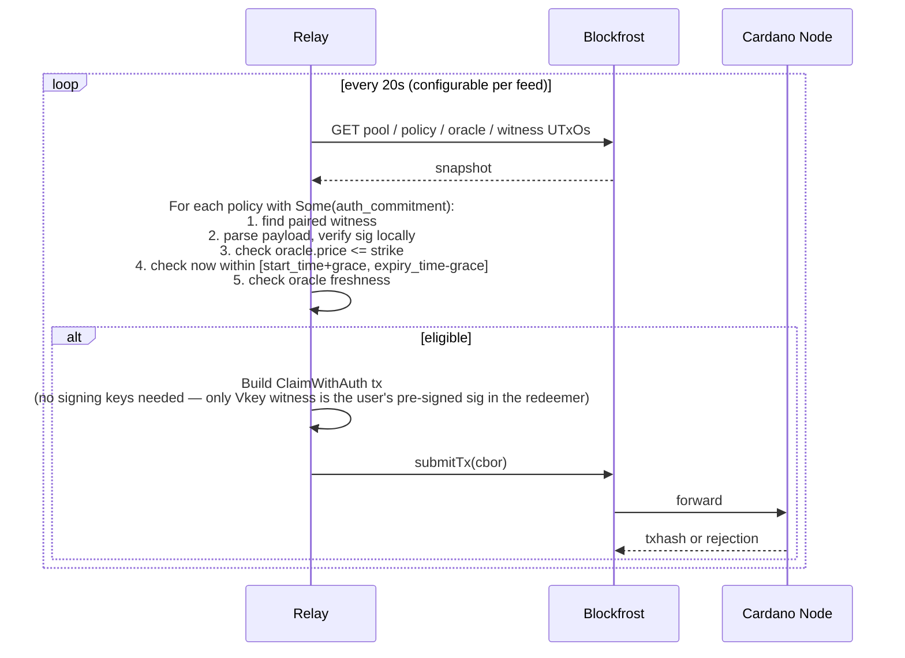
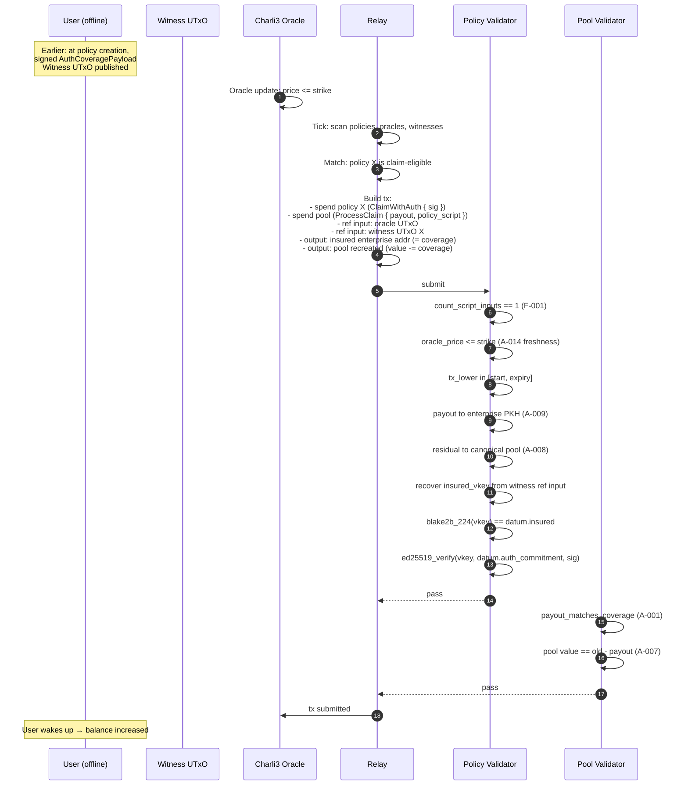

# Aegis — Keyless Relay + Pre-Signed Claim Authorization

**Status:** Design scope, not implementation.
**Author:** PACT Architect
**Date:** 2026-04-30
**Audience:** Plutus + TypeScript engineers building this.
**Pre-reqs read:** `contracts/lib/aegis/types.ak`, `contracts/validators/policy.ak`, `contracts/validators/pool.ak`, `docs/audit/SECURITY_AUDIT_REPORT.md` (A-001..A-020), `frontend/src/wallet/aegis/auto_claim.ts`, `api/policies.py`, `configs/deploy-state.preprod.json`.

---

## 0. Goal in one sentence

Make auto-claim fire while the user is fully offline, **without** the relay holding any spending key, by having the user sign a narrow claim authorization at policy creation time and letting any relay submit a tx that the validator only accepts when that specific authorization is present.

---

## 1. On-chain changes (Aiken)

### 1.1 PolicyDatum — add ONE field

We just rotated the datum schema in the post-A-008 / post-A-020 pass and added two fields (`pool_nft`, `lp_supply` in PoolDatum). We are not multiplying the schema again. Add exactly one field at the **end** of `PolicyDatum`, preserving positional CBOR encoding:

```
pub type PolicyDatum {
  policy_id, insured, strike_price, coverage_amount, premium_paid,
  start_time, expiry_time, oracle_nft, pool_script_hash, pool_nft,
  // NEW (post-A-021):
  auth_commitment: Option<ByteArray>,   // 32-byte BLAKE2b-256 hash, or None for legacy / direct-claim-only policies
}
```

Why `Option<ByteArray>` and not `ByteArray`:

- Backwards compatibility with the in-browser auto-claim path (when no relay is needed, the field is `None` and Claim falls through the existing branch unchanged).
- A future v2 deployment can flip the field non-optional once we're confident; today, optional keeps the validator branches surgical.
- The 32-byte content is the BLAKE2b-256 hash of the canonical CBOR-encoded `AuthCoveragePayload` (see §2.1).

The field is appended; old datum CBORs (none in production yet — preprod is fresh per `deploy-state.preprod.json`) cannot decode against the new shape, but since the deploy is greenfield this is acceptable.

### 1.2 New PolicyRedeemer variant

Add a single new variant, do not modify existing ones:

```
pub type PolicyRedeemer {
  Claim
  BatchClaim
  Expire
  BatchExpire
  Cancel
  // NEW:
  ClaimWithAuth { sig: ByteArray }   // Ed25519 signature over auth_commitment, by datum.insured
}
```

`sig` is a 64-byte raw Ed25519 signature. The vkey is the `insured` (already in datum as `VerificationKeyHash`) — but we cannot recover the public key from the hash, so the **claimer must also include the insured's vkey as a tx-level required signer reference OR pass it through the redeemer**.

Decision: **redeemer carries `sig` only**. The full vkey is provided as a reference input via a new "auth witness UTxO" (see §2.3). This avoids inflating redeemer size and keeps witnesses verifiable on-chain without trusting the submitter to pass the right key.

### 1.3 Validator branch — `ClaimWithAuth`

Implements exactly the same checks as `Claim` (oracle, freshness, time bounds, payout aggregation, residual to canonical pool) **plus**:

1. `expect Some(commit) = datum.auth_commitment` — fail if the policy was issued without authorization.
2. Find the auth-witness reference input (matched by a deterministic NFT — see §2.3). Parse its inline datum to recover the insured's full vkey.
3. Verify `blake2b_224(vkey) == datum.insured` (binding the recovered key to the insured PKH).
4. Verify `ed25519_verify(vkey, commit, redeemer.sig) == True` using Aiken's `aiken/crypto.{verify_ed25519_signature}`.
5. **Crucially:** the on-chain check confirms the signature commits to *this exact policy datum's* `auth_commitment`, which itself binds payout destination and coverage caps. The relay cannot alter what was signed; it can only *replay* the signature against the same policy.

The `Claim` and `BatchClaim` branches stay byte-for-byte identical so the load-bearing audit fixes (A-001 / A-006 / A-008 / A-009 / A-010 / A-012 / A-013) are not regressed.

**Single-input invariant.** `ClaimWithAuth` reuses `count_script_inputs(inputs, own_script_hash) == 1` (per A-006/F-001) — relay cannot batch.

**Time bounds.** A-014 (oracle staleness window) is enforced unchanged via `is_oracle_valid(oracle_datum, tx_lower)` (`policy.ak:139`).

**Signature replay across policies.** Impossible — `auth_commitment` includes `policy_id` (§2.1), so a sig for policy A is invalid for policy B even if both have the same insured.

### 1.4 No pool changes

`pool_validator.ProcessClaim` is not changed. The relay-built tx still carries the existing `ProcessClaim { payout, policy_script }` redeemer for the pool input. Anti-A-001 binding (`policy_targets_this_pool && payout == coverage_amount`) keeps payout bounded to the consumed policy's coverage. No new pool redeemer.

### 1.5 Hashes and ref scripts

`policy_validator` rotates (new branch added → new compiled hash). New ref UTxO published; old `74ad05aa…#0` retired. `pool_validator`, `lp_token_policy`, `pool_nft` policy unchanged.

---

## 2. Pre-signed authorization

### 2.1 Canonical payload

The user signs the BLAKE2b-256 hash of the canonical-CBOR encoding of:

```
AuthCoveragePayload {
  domain_tag        : ByteArray,  // ascii "AEGIS_CLAIM_AUTH_v1" — unambiguous domain separation
  network_magic     : Int,        // 1 for preprod, 764824073 for mainnet
  policy_validator  : ByteArray,  // 28-byte script hash of the policy validator
  policy_id         : ByteArray,  // PolicyDatum.policy_id (28-byte BLAKE2b-224 of policy terms)
  insured_pkh       : ByteArray,  // PolicyDatum.insured
  payout_address    : ByteArray,  // 29-byte enterprise CIP-19 address bytes (header + pkh) — see A-009
  max_coverage      : Int,        // == PolicyDatum.coverage_amount, NOT a relay-supplied value
  oracle_nft        : ByteArray,  // PolicyDatum.oracle_nft
  oracle_asset_name : ByteArray,  // empty bytes today; reserved for multi-feed contracts
  oracle_freshness  : Int,        // ms; mirrors on-chain is_oracle_valid window
  not_before        : Int,        // POSIX ms — rolling window start
  not_after         : Int,        // POSIX ms — auth expiry (≤ datum.expiry_time)
  pool_script_hash  : ByteArray,
  pool_nft          : ByteArray,
}
```

`auth_commitment = blake2b_256(canonical_cbor(payload))`. This is what's stored on-chain and what the user signs with their Aegis-wallet Ed25519 key.

**Why this exact field set (each with a validator counter-check):**

| Field | What it binds | Validator check that enforces it |
|---|---|---|
| `policy_validator` | which script can use this auth | implicit: signature only verifies against this datum's `auth_commitment`, which is bound to a specific deployed validator |
| `policy_id` | exactly one policy | datum field equality, computed by validator from `auth_commitment` |
| `insured_pkh` | who the insured is | `blake2b_224(vkey) == datum.insured` |
| `payout_address` | destination of funds | `sum_lovelace_to_enterprise_pkh(outputs, datum.insured)` (A-009) — note: insured is the only legal payee per existing fix |
| `max_coverage` | dollar cap | `payout_valid` requires sum `>= datum.coverage_amount` AND pool's `ProcessClaim` requires `payout == policy.coverage_amount` (A-001) |
| `oracle_nft` + asset | which oracle feed | `find_oracle_datum(reference_inputs, datum.oracle_nft)` |
| `oracle_freshness` / `not_before` / `not_after` | when it's valid | `is_oracle_valid` + `tx_lower >= datum.start_time` + `tx_upper <= datum.expiry_time` |
| `pool_script_hash` + `pool_nft` | which pool gets the residual | `find_canonical_pool_output` (A-008) |
| `domain_tag` + `network_magic` | mainnet/preprod isolation, no cross-protocol replay | implicit: hash of payload differs between networks |

The **whole point** is that `auth_commitment` is a one-way commitment to all of those fields. The validator only needs to verify the signature against `datum.auth_commitment`; the *meaning* of that commitment is enforced because the datum and tx structure are independently checked against the same constraints. The relay can lie about the pre-image only by producing a colliding hash, which is infeasible.

### 2.2 Client-side signing

At policy creation (Underwrite tx), with both wallets available:

1. CIP-30 wallet pays the premium and signs the Underwrite tx (this part is unchanged).
2. Frontend computes `payout_address` = the user's Aegis-wallet enterprise address (already what the existing in-browser auto-claim pays out to) OR the user's main CIP-30 receive address — **operator decision, see Open Q1**.
3. Frontend assembles the `AuthCoveragePayload`, canonical-CBOR-encodes it, BLAKE2b-256s the encoding to get `auth_commitment`.
4. Frontend signs `auth_commitment` with the Aegis wallet's Ed25519 seed (reuses `signTransactionBytes` from `frontend/src/wallet/aegis/signer.ts:signTransactionBytes` — same primitive, different message). The seed is reconstructed via Shamir-2-of-3 per the existing flow, used once, scrubbed.
5. The Underwrite tx is built with `PolicyDatum.auth_commitment = Some(commit)`.
6. The signature plus the full `AuthCoveragePayload` (so anyone can verify) is submitted to a separate "publish auth" call (§2.3).

If the user opts out of relay coverage (privacy, paranoia), step 3-5 set `auth_commitment = None`, step 6 is skipped, and the policy reverts to in-browser-only auto-claim. This is a per-policy choice exposed in the UI.

### 2.3 Where the witness lives

Three options considered. We recommend **Option B**.

| | Where stored | Pros | Cons |
|---|---|---|---|
| **A. Inside the policy datum** | `PolicyDatum.auth_signature` field added | Self-contained; relay needs no extra UTxO | Datum size grows by ~96 bytes per policy; signature is published the moment the policy is created (no privacy benefit); we'd be touching the schema *again* right after the post-audit pass |
| **B. Separate "auth witness UTxO"** at a dedicated *non-spendable* always-fail address, identified by a deterministic NFT (BLAKE2b-224 of `policy_id` minted by a `auth_witness_nft` policy keyed to `policy_id`). Datum holds vkey + sig + payload pre-image. | Decouples auth lifecycle from policy lifecycle; lets us rotate auths (rare) without touching policy datum; relay finds the witness by deterministic policy_id-derived asset name; one UTxO per policy, indexable | One extra mint at policy creation (~+0.5 ADA min-UTxO + tiny fee); adds a third minting policy to the deploy |
| **C. Off-chain / centralized index** (e.g. Postgres in front of the relay) | Cheapest on-chain; private | Trust on the relay to publish auths; censorship-vulnerable; recovery is impossible if relay disappears; defeats the open-source-anyone-can-run goal |

**Recommendation: Option B.** The deterministic NFT name lets any independent relay locate every active auth by scanning UTxOs at the witness address — no central index required. The witness UTxO datum is:

```
AuthWitnessDatum {
  policy_id: ByteArray,      // pairs to PolicyDatum.policy_id
  insured_vkey: ByteArray,   // 32-byte Ed25519 public key (whose blake2b_224 == insured)
  payload_cbor: ByteArray,   // canonical CBOR of AuthCoveragePayload (so any relay can verify locally)
  signature: ByteArray,      // 64-byte Ed25519
}
```

The witness UTxO **does not need to be consumed** by the claim tx — it is referenced via `reference_inputs` (read-only). The relay points the claim tx at it; the validator reads `insured_vkey` from its datum and verifies the signature in the redeemer. Cheap on EX units (one Ed25519 verify), no extra spend.

Cleanup: when policy is claimed/expired/cancelled, the witness UTxO is orphaned. An optional sweeper script (run by anyone) can collect orphaned witnesses by checking that the matching policy no longer exists; recovers the min-UTxO ADA. Out of scope for v1.

---

## 3. Off-chain relay service (`aegis-relay`)

### 3.1 Architecture

```mermaid
flowchart LR
    subgraph On-Chain
      ORACLE[Charli3 ODV Oracle UTxO]
      POLICY[Policy UTxOs<br/>auth_commitment = Some(...)]
      WITNESS[Auth Witness UTxOs<br/>vkey + sig + payload]
      POOL[Pool UTxO]
    end

    subgraph aegis-relay (Fly.io, single proc)
      WATCHER[Oracle Watcher<br/>polls reference UTxOs]
      INDEXER[Policy Indexer<br/>scans validator address]
      MATCHER[Trigger Matcher<br/>price <= strike?]
      BUILDER[Tx Builder<br/>ClaimWithAuth redeemer]
      SUBMITTER[Submitter<br/>Blockfrost]
    end

    BF[Blockfrost API]

    WATCHER -->|new oracle datum| MATCHER
    INDEXER -->|active policies + matching witnesses| MATCHER
    MATCHER -->|claim-eligible| BUILDER
    BUILDER -->|references<br/>policy + witness + oracle| ORACLE
    BUILDER -->|references<br/>policy + witness + oracle| WITNESS
    BUILDER -->|consumes| POLICY
    BUILDER -->|consumes + recreates| POOL
    BUILDER --> SUBMITTER
    SUBMITTER --> BF
    BF --> WATCHER
    BF --> INDEXER
```

**Single Fly.io process.** No DB, no queue, no Redis. State is recomputed each tick from chain data + Blockfrost. Persistent state is exactly: `BLOCKFROST_PROJECT_ID` env var, an optional `BLOCKFROST_NETWORK` ("preprod"|"mainnet"). No keys.

### 3.2 Data sources

| Need | Source |
|---|---|
| Active policies | Blockfrost `addresses/{policy_validator_addr}/utxos` filtered to those with `PolicyDatum.auth_commitment = Some(...)` |
| Auth witnesses | Blockfrost `assets/{auth_witness_policy}/{policy_id_asset_name}/addresses` → UTxOs at the dedicated witness address; parse datum |
| Oracle datum | Blockfrost UTxO at the Charli3 ODV oracle address holding the relevant feed NFT (per `reference_charli3_preprod_configs.md`) |
| Pool UTxO | Blockfrost UTxO at `POOL_SCRIPT_ADDRESS` carrying `pool_nft` |

### 3.3 Tick loop



The tx the relay submits is **not signed by the relay** in the witness-set sense (it has no Vkey it could sign with that the validator cares about). The Ed25519 signature is in the *redeemer* of the policy input. The tx **may** still need a relay-paid collateral input — collateral can be any low-value UTxO at any address; the relay's operator funds it from a hot wallet that holds nothing of value (a few ADA for tx fees + collateral). Collateral is forfeit only if the script *unexpectedly* fails phase-2; if the relay's pre-checks mirror on-chain checks, this should be rare.

### 3.4 Avoiding double-claim

- **On-chain primitive:** the policy UTxO is consumed by Claim. Two relays submitting in the same slot → one wins, the other's tx fails because its input is no longer present. The relay treats `UtxoAlreadySpent` as a non-error and moves on.
- **In-flight dedup:** a per-relay in-memory `pending: Set<txHash>` with TTL 120s (mirrors `_consumed_utxos` cache in `api/policies.py:81`). Prevents re-submitting the same tx within one tick window. Not synchronized across relays — and that's fine: chain is the dedup oracle.
- **Cross-path coordination (in-browser wallet vs. relay):** none needed. Both target the same policy UTxO; whoever lands on chain first wins. The other side sees `UtxoAlreadySpent`.

### 3.5 Threat model

| Adversary capability | Worst outcome |
|---|---|
| Relay operator is fully malicious | (a) Refuses to submit → user falls back to in-browser auto-claim. (b) Submits malformed tx → validator rejects, user is unaffected. (c) Submits a tx that pays *somewhere else* → cannot, because A-009 forces enterprise output to `datum.insured`, and `auth_commitment` binds payout address. (d) Submits early → cannot, oracle check fails. (e) Submits without oracle being below strike → `price_below_strike` fails. **Net: worst case is liveness, never safety.** |
| Multiple competing relays | Benign UTxO contention; first-mined wins, others fail. No fee waste beyond one wasted submission per losing relay. |
| Relay learns the user's auth signature | The signature already authorizes one specific policy with bounded payout to a fixed address. Knowing it grants no new capability the validator doesn't already permit. |
| Relay's Blockfrost key is compromised | Attacker can read public chain data. They cannot spend anything. |
| MEV / front-running | The valid claim window is the entire post-trigger lifetime of the policy. Front-running has no economic benefit (relay earns no on-chain fee from claims). Optional v2: bounty model (small ADA tip in a relay output) — explicitly out of v1 scope. |

The strict invariant: **a relay can always cause `fail to broadcast` or `broadcast a tx the validator rejects`. It can never cause `funds end up anywhere other than insured's enterprise address bound by the original sig`.**

---

## 4. Integration with current SSS auto-claim

The existing `tickAutoClaim` (`auto_claim.ts:90`) keeps working unchanged. New decision matrix at policy creation:

| User state at create time | `auth_commitment` set? | Relay covers? | In-browser covers? |
|---|---|---|---|
| Online with both wallets, opts in to relay | `Some(commit)` | Yes | Yes (redundant, fine) |
| Online with both wallets, opts out of relay | `None` | No | Yes |
| Has only CIP-30 wallet, never set up Aegis wallet | `None` | No | No (manual claim only) |

Auth lifecycle is **bound to the seed** — if the user rotates their Aegis wallet seed, all existing auths still work for existing policies (the auth was signed against the old key, which the witness UTxO still holds). New policies use the new key.

If the user *deletes* their Aegis wallet, the witness UTxOs remain on chain; relay can still claim. To revoke, the user must `Cancel` the policy (only available within the cancellation window) or wait for `Expire`.

No coordination protocol between relay and in-browser is needed. The validator's UTxO consumption acts as a distributed lock.

---

## 5. Migration path

Preprod is fresh per `deploy-state.preprod.json` — no production policies exist yet. So this is greenfield.

```mermaid
flowchart TD
    A1[1. Aiken: add auth_commitment field<br/>add ClaimWithAuth branch<br/>add auth_witness_nft minting policy] --> A2[2. aiken check — green;<br/>add A-021 negative tests:<br/>- bad sig rejected<br/>- wrong vkey rejected<br/>- replay across policies rejected<br/>- ClaimWithAuth on None-auth policy rejected]
    A2 --> A3[3. Recompile, capture new hashes;<br/>publish new ref UTxOs;<br/>retire old policy_validator ref]
    A3 --> A4[4. api/policies.py:<br/>- extend PolicyDatum dataclass<br/>- add ClaimWithAuthRedeemer<br/>- new build_claim_with_auth_tx<br/>- new build_publish_auth_witness_tx]
    A4 --> A5[5. Frontend: AuthCoveragePayload encoder,<br/>commitment hasher,<br/>signing flow at policy creation,<br/>UI toggle "Enable offline auto-claim"]
    A5 --> A6[6. aegis-relay: new repo,<br/>Fly.io deploy,<br/>Blockfrost-only state]
    A6 --> A7[7. End-to-end preprod test:<br/>- create policy with auth<br/>- shut user's browser<br/>- refresh oracle below strike<br/>- relay claims within 1 tick]
    A7 --> A8[8. Cross-stack test additions ~+30 tests<br/>brings the 529-test suite to ~559]
```

Order is rigid: (1) contracts → (2) tests → (3) ref scripts → (4) API → (5) frontend → (6) relay. Each step is shippable in isolation; reverting only requires not flipping the UI toggle.

Estimated effort: **~6–8 dev-days for one engineer comfortable with both stacks**, dominated by the relay (~2 days) and the cross-stack tests (~2 days). Validator change is small (~half day).

---

## 6. Failure modes

| Failure | What happens | User-visible recovery |
|---|---|---|
| Relay process dies | In-browser auto-claim continues working as today | None needed; user is whole if they're ever online during the trigger |
| Relay's Blockfrost key revoked | Relay halts until a new key is configured | None needed (degrades to in-browser path) |
| Oracle feed stale | `is_oracle_valid` rejects (per A-014); relay sees the rejection in pre-check and skips submission | Wait for next oracle refresh; auto-retry next tick |
| User loses Aegis wallet seed | Auth witness UTxO still on chain; relay can still claim until policy expires. If user wants funds back early, they `Cancel` from CIP-30 main wallet (per A-010 ITM guard, only allowed when out-of-the-money) | Cancel via CIP-30 → 90% premium refund per A-020 |
| Auth witness UTxO lost / never published | Relay can't act; in-browser path still works if user comes online | If user has the seed, sign and re-publish a new witness UTxO (idempotent; relay picks up the most recent) |
| Multiple relays race | Only one tx lands; others fail with `UtxoAlreadySpent`. Each loser pays ~0 (failed submit, no on-chain fee for non-included tx) | None — by design |
| Relay submits a malformed tx | Phase-1 validation fails at node; tx not included; relay logs and skips | Relay operator monitoring |
| Relay submits a tx that fails phase-2 (script error) | Collateral forfeit (relay operator's loss, not user's) | Relay operator's pre-checks should mirror validator checks; bug bounty for any reproducible case |
| Oracle fires but in-browser tab is also open | Both submit; chain dedups via UTxO consumption | None needed |
| Policy expires before oracle ever fires | Standard `Expire` path returns funds to pool | Existing flow unchanged |

---

## 7. What this design DOES NOT do — with cited validator checks

| Forbidden capability | Validator check that prevents it |
|---|---|
| Relay redirects payout | `policy.ak:154` — `sum_lovelace_to_enterprise_pkh(outputs, datum.insured)`; the only legal payee is the insured's PKH, and it must be at an enterprise address (A-009) |
| Relay claims more than coverage | Pool's `ProcessClaim` branch (`pool.ak:289`) — `payout == policy_datum.coverage_amount` (A-001) |
| Relay claims before oracle fires | `policy.ak:135` — `oracle_price <= datum.strike_price` |
| Relay claims after policy expiry | `policy.ak:144` — `tx_upper <= datum.expiry_time` |
| Relay claims before policy starts | `policy.ak:142` — `tx_lower >= datum.start_time` |
| Relay routes residual to fake pool | `policy.ak:161` — `find_canonical_pool_output(outputs, datum.pool_script_hash, datum.pool_nft)` (A-008) |
| Relay re-uses a sig across policies | `auth_commitment` includes `policy_id`; signature validates only against the matching policy's datum field |
| Relay swaps the auth witness for someone else's | Witness UTxO must hold an NFT whose asset name is deterministically derived from `policy_id`; the validator (in `ClaimWithAuth` branch) verifies that the reference input's NFT matches the consumed policy's `policy_id` |
| Relay forges a signature | Ed25519 collision-resistance under standard assumptions |
| Relay double-claims same policy | `count_script_inputs == 1` (A-006/F-001) + UTxO is consumed |
| Relay claims a Cancel-redeemed policy | `Cancel` consumed the policy; nothing left to claim |

---

## 8. Open questions

1. **Payout address ambiguity.** Today's in-browser auto-claim pays into the user's *Aegis wallet enterprise address* (so the funds are auto-claimable later). For relay claims, does the user prefer their (a) Aegis wallet (consistent UX) or (b) main CIP-30 receive address (funds immediately spendable in their primary wallet)? Both are legal per A-009 (insured PKH is what matters; both addresses share that PKH for option (b) only if main wallet is enterprise-shaped — most wallets use base addresses with stake credentials, which would FAIL A-009). Recommendation: stick with the Aegis wallet enterprise address for now; revisit when a clean "destination = main-wallet enterprise variant" UX is designed. **Decision required before implementation.**

2. **Oracle freshness window in `AuthCoveragePayload`.** Should the `oracle_freshness` field be enforced redundantly on-chain (validator reads it from the witness pre-image) or only off-chain (relay refuses to submit)? Redundant on-chain = stronger guarantee but adds CBOR-decode of the payload to the validator's hot path (+EX units). Recommend off-chain enforcement only, since `is_oracle_valid` already enforces a global freshness bound — but flag for review.

3. **Auth rotation.** If the user wants to change their `payout_address` after policy creation (e.g., they migrate wallets), they must produce a new auth and a new witness UTxO. The on-chain commitment is in the policy datum and is *immutable* without modifying the policy. Options: (a) accept that auth is fixed for a policy's life, (b) add a `RotateAuth` policy redeemer that consumes the policy and recreates it with a new `auth_commitment` (gated by CIP-30 main-wallet sig), (c) extend witness UTxO to be replaceable independently of the policy (requires the on-chain commitment to instead live in the witness datum and a different verification scheme). Recommend (a) for v1.

4. **Charli3 oracle hash pinning (A-016 still open).** The relay-built tx points at the oracle by NFT only, same as the rest of the protocol. Whatever fix lands for A-016 (script-hash pin) applies uniformly to `Claim`, `BatchClaim`, and `ClaimWithAuth`. No relay-specific work needed once A-016 is closed.

5. **Witness UTxO size / min-UTxO cost.** Each policy now has an additional ~3.5 ADA min-UTxO locked in the witness. This is a real per-policy cost. Decision: charge it as part of the premium structure (transparently) or eat it from protocol fees. Recommend transparent — disclose in policy creation UI.

6. **Mainnet rollout (out of v1 scope but flag now).** Mainnet auth witnesses are publicly visible. The witness datum reveals: insured PKH, payout address, exact coverage cap, oracle feed, time window. This is a privacy regression vs. the in-browser path (where only the policy datum is public, not the auth). Mitigation options: (a) accept it, (b) commit to only `auth_commitment` in the witness UTxO and force the relay to learn the pre-image off-chain (defeats the open-anyone-can-run goal), (c) Aiken-side ZK proof of well-formed auth (prohibitively expensive in 2026). Recommend (a); document loudly.

7. **Relay incentive alignment.** Today the relay is fully altruistic. If we want sustainability we eventually need to (a) tip the relay from the pool's protocol fee, or (b) include a small "relay tip" output bound by validator checks. Either is a follow-up — explicitly NOT in v1.

---

## 9. Tx flow — `ClaimWithAuth`



---

## 10. Acceptance checklist (Code-phase exit criteria)

- [ ] All 529 existing cross-stack tests still green.
- [ ] New tests: `ClaimWithAuth` happy path; bad-sig rejection; wrong-vkey rejection; cross-policy replay rejection; `ClaimWithAuth` against `None`-auth policy rejected; A-001 / A-006 / A-008 / A-009 / A-010 / A-012 / A-014 invariants preserved through the new branch.
- [ ] `aegis-relay` deployable to Fly.io with one env var.
- [ ] End-to-end preprod scenario: create policy with auth → close all browser tabs → refresh oracle below strike → relay claims within 60s → audit log shows `txHash` produced by relay, not in-browser tab.
- [ ] All claim paths (in-browser + relay) pay to the *same* insured-bound enterprise address.
- [ ] No new dependency on a centralized index; relay state is purely a function of chain data + Blockfrost.
- [ ] Documentation (`docs/architecture/RELAY_PRESIGNED_AUTH_SCOPE.md`, this file) updated with final hashes after redeploy.

---

## Appendix A — File-level change inventory

| File | Change |
|---|---|
| `contracts/lib/aegis/types.ak:29-56` | Add `auth_commitment: Option<ByteArray>` to `PolicyDatum`. Add `ClaimWithAuth { sig }` to `PolicyRedeemer`. |
| `contracts/validators/policy.ak:118` | New branch in `when redeemer is { ... }` for `ClaimWithAuth`. |
| `contracts/validators/auth_witness.ak` (new) | One-shot mint policy keyed to `policy_id`; lock-only address (always-fail spend). |
| `contracts/lib/aegis/test_helpers/security_tests.ak` | New `green_a_021_*` tests. |
| `api/policies.py:180` | Extend `PolicyDatum` dataclass with `auth_commitment`. New `ClaimWithAuthRedeemer` (CONSTR_5). New `build_claim_with_auth_tx` helper. New endpoint to publish witness UTxO at policy creation. |
| `frontend/src/wallet/aegis/auth_payload.ts` (new) | Canonical CBOR encoder for `AuthCoveragePayload` + commitment hasher. |
| `frontend/src/wallet/aegis/signer.ts` | Add `signAuthCommitment` (wraps existing `signTransactionBytes` over `auth_commitment` bytes with the same scrub discipline). |
| Frontend policy-creation page | UI toggle "Enable offline auto-claim (recommended)"; on submit, sign + publish witness in same flow. |
| `aegis-relay/` (new repo) | Single-process Node/TS service. Fly.toml + Dockerfile. Blockfrost SDK + Lucid for tx building. |
| `configs/deploy-state.preprod.json` | New entries: `policy_validator` (rotated hash), `auth_witness_policy`, witness ref UTxOs. |

---

**Decision authority required before code starts:** Open Q1 (payout address default) and Q5 (witness min-UTxO cost disclosure UX). Everything else can be locked into this design as written.
