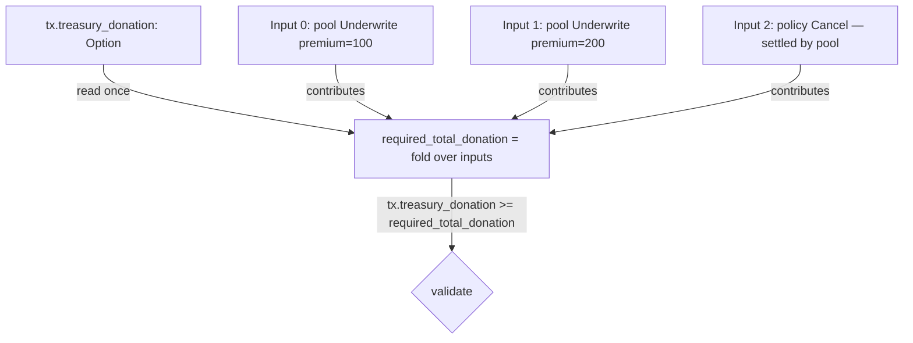

# Aegis — Cardano Treasury Donation, Validator-Enforced

**Status:** Design scope, not implementation.
**Author:** PACT Architect
**Date:** 2026-04-30
**Audience:** Plutus + TypeScript engineers building this.
**Pre-reqs read:** `contracts/lib/aegis/types.ak`, `contracts/lib/aegis/pricing.ak`, `contracts/validators/policy.ak`, `contracts/validators/pool.ak`, `docs/audit/SECURITY_AUDIT_REPORT.md`, `api/policies.py`, `configs/deploy-state.preprod.json`, `docs/RELAY_PRESIGNED_AUTH_SCOPE.md`.

---

## 0. Goal in one sentence

Have every Aegis fee-bearing transaction route a fixed share (default `2500 bps of protocol fee` = 25% of the 2% protocol fee = 0.5% of premium) into the on-chain Cardano protocol treasury via the Conway-era `treasury_donation` transaction-body field, with a Plutus V3 validator branch that fails the tx if the donation is short by even one lovelace.

---

## 1. Aiken stdlib viability

### 1.1 Current pin

`D:/aegis/contracts/aiken.toml`:

```toml
compiler = "v1.1.21"
[[dependencies]]
name = "aiken-lang/stdlib"
version = "v3.0.0"
```

### 1.2 What we need from stdlib

`stdlib v3.0.0`'s `cardano/transaction.{Transaction}` already exposes the two Conway-era fields we need on the `Transaction` record:

```aiken
pub type Transaction {
  inputs: List<Input>,
  reference_inputs: List<Input>,
  outputs: List<Output>,
  fee: Lovelace,
  mint: Value,
  certificates: List<Certificate>,
  withdrawals: Pairs<Credential, Lovelace>,
  validity_range: ValidityRange,
  extra_signatories: List<VerificationKeyHash>,
  redeemers: Pairs<ScriptPurpose, Redeemer>,
  datums: Dict<DataHash, Data>,
  id: TransactionId,
  votes: Pairs<Voter, Pairs<GovernanceActionId, Vote>>,
  proposal_procedures: List<ProposalProcedure>,
  current_treasury_amount: Option<Lovelace>,   //  needed
  treasury_donation: Option<Lovelace>,         //  needed
}
```

Source: aiken-lang/stdlib `lib/cardano/transaction.ak`, post v2.0.0 PlutusV3 rework (the "Transaction type from cardano/transaction has been greatly reworked to match the new transaction format in Plutus V3" entry in stdlib's CHANGELOG). Both fields are present in v3.0.0.

### 1.3 Conclusion

**No stdlib upgrade required.** The pattern-binding `let Transaction { inputs, reference_inputs, outputs, validity_range, extra_signatories, .. } = self` in `policy.ak:99-106` and `let Transaction { inputs, outputs, mint, .. } = self` in `pool.ak:163` already discards every other field via `..`. Adding `treasury_donation` (and, for redundant safety, `current_treasury_amount`) to those bindings is a one-line touch each. The existing 5,314-byte compiled `pool_validator` and 3,107-byte `policy_validator` (`deploy-state.preprod.json`) will grow modestly — see §8 for size impact.

### 1.4 What we deliberately do NOT do

- We do **not** adopt the deprecated alias `aiken/transaction` — the codebase already uses `cardano/transaction` everywhere (verified in `policy.ak:31`, `pool.ak:34`, `pool_nft.ak:41`, `lp_token.ak:18`, `validation.ak:15`, `oracle.ak:12`). One module convention, no churn.
- We do not try to read `current_treasury_amount` for any logic. That field is informational (the pre-tx treasury balance) and only relevant to validators that want to constrain behavior to "the treasury must be at least X". For Aegis the field is not used; we only need the donation field.

---

## 2. Where the cut applies in Aegis flows

The donation is sourced from the existing `protocol_fee_bps` (currently `200` = 2%, `types.ak:218` and stored on `PoolDatum.protocol_fee_bps`). We do not raise the fee to the user; we redirect a slice of what we already keep.

Define a single new global constant in `contracts/lib/aegis/types.ak`:

```aiken
/// Share of the protocol fee (NOT premium) routed to the Cardano treasury.
/// 2500 bps of fee = 25% of fee = 0.5% of premium when protocol_fee_bps=200.
pub const treasury_share_bps: Int = 2_500
```

And one helper in `contracts/lib/aegis/pricing.ak`:

```aiken
pub fn calculate_treasury_cut(premium: Int, protocol_fee_bps: Int, treasury_share_bps: Int) -> Int {
  // floor((premium * protocol_fee_bps / 10_000) * treasury_share_bps / 10_000)
  // == floor(premium * protocol_fee_bps * treasury_share_bps / 100_000_000)
  premium * protocol_fee_bps / 10_000 * treasury_share_bps / 10_000
}
```

Two-stage division is deliberate: it matches the existing `calculate_protocol_fee` rounding (`pricing.ak:50`) and avoids a 64-bit overflow scare on premium magnitudes that fit Cardano's lovelace range. Floor-rounding gives the user the lovelace, not the treasury.

### 2.1 Per-redeemer policy

| Validator branch | File:Line | Donation source | Formula | Datum schema change? |
|---|---|---|---|---|
| `pool.Underwrite { coverage, premium }` | `pool.ak:188` | New protocol fee ARRIVING this tx | `floor(premium × 200 × 2500 / 1e8)` | **NO** |
| `pool.BatchUnderwrite { total_premium, .. }` | `pool.ak:424` | Aggregate fee arriving this tx | `floor(total_premium × 200 × 2500 / 1e8)` | **NO** |
| `pool.AcceptCancellation { policy_script }` | `pool.ak:573` | Cancellation fee = 10% of premium that we're already keeping | `floor(consumed.premium_paid × 1_000 × 2500 / 1e8)` | **NO** |
| `pool.ProcessClaim` / `pool.BatchExpireProcess` | `pool.ak:251` / `pool.ak:490` | **NONE.** Claims pay LPs out of pool; they are losses, not fees. | n/a — see 2.2 |
| `pool.AddLiquidity` / `pool.RemoveLiquidity` | `pool.ak:326` / `pool.ak:372` | **NONE.** No fee on LP movement today. | n/a |
| `policy.Claim` / `policy.BatchClaim` / `policy.Expire` / `policy.BatchExpire` | `policy.ak:122/181/247/275` | **NONE.** No fee at the policy validator level (the policy validator owns no fee). | n/a |
| `policy.Cancel` | `policy.ak:305` | Settled by `pool.AcceptCancellation`, which is co-spent in the same tx and carries the donation check. | n/a |

### 2.2 Why claims do NOT donate

ProcessClaim is a **payout from LPs to the insured**. It is the protocol delivering on its promise. A "haircut" to the treasury here would be a stealth tax on LPs at the moment they take a loss — economically and narratively the worst possible direction. Underwrite is the correct moment because:

1. It is the only branch where new value arrives at the protocol (the premium).
2. The protocol fee is denominated **in that flow** — the treasury cut comes out of money the protocol is already keeping. Zero new burden on the user, zero new burden on LPs.
3. Pitch narrative is honest: "every Aegis policy gives back to Cardano" — true, because every policy is born via Underwrite.

### 2.3 Why no schema change

`treasury_share_bps` is a **compile-time constant**, not a `PoolDatum` field. Reasons:

1. We just rotated the schema (post-A-008 pass added `pool_nft` to `PolicyDatum`; A-003 added `lp_supply` to `PoolDatum`). Touching the schema again drifts hashes and risks regressing other audit fixes.
2. Changing the cut requires a redeploy (new validator hash). That is correct — the user-facing economic terms should be code-pinned, not operator-mutable. A datum-mutable cut would let the operator silently raise the donation and make the treasury an extraction vector.
3. If/when we want a configurable cut, the right design is a parameterized validator (the Aiken `validator(treasury_share_bps: Int) -> spend(...)` pattern), not a datum field. Out of scope for v1.

---

## 3. The double-satisfaction trap (the critical bit)

`treasury_donation` is **one global field on the tx body**. Naively, every script input branch checking `tx.treasury_donation >= my_cut` is fundamentally broken: a single tx that consumes 5 BatchUnderwrite policies could pay one donation that "satisfies" all 5 expectations via the same lovelace.

This is the same vulnerability class as A-008 (canonical pool routing) and A-006 (single payout output satisfying multiple same-insured policies). We must not re-open this surface.

### 3.1 The right pattern

Every script-input branch that owes a donation must compute the **total donation obligation across every co-spent script input that owes a donation**, then check the global field once:



For Aegis, the simplification is that **only the pool validator branches owe a donation**. The policy validator owes none (Cancel's donation is owed by the co-spent `AcceptCancellation` pool branch). And the pool is a singleton — there is exactly one pool UTxO consumed per tx (enforced by `pool_nft` uniqueness, A-011 fix). So:

> **The pool validator's branch can compute the entire donation obligation locally from its own redeemer + the consumed policy datums (in the cancel path), and check the global `tx.treasury_donation >= obligation` directly. There is no fold across multiple pool inputs because there are no multiple pool inputs.**

This collapses the double-satisfaction concern to: **the pool validator is the single point that reads `tx.treasury_donation`**. The policy validator never reads it.

### 3.2 Specific pool branches

```aiken
// Inside pool_validator's `let Transaction { ..., treasury_donation, .. } = self`
// and inside each fee-bearing branch:

// Underwrite { coverage, premium }
let required_donation = calculate_treasury_cut(premium, datum.protocol_fee_bps, treasury_share_bps)
let donation_ok =
  when treasury_donation is {
    Some(amt) -> amt >= required_donation
    None      -> required_donation == 0
  }

// BatchUnderwrite { total_coverage, total_premium }
let required_donation = calculate_treasury_cut(total_premium, datum.protocol_fee_bps, treasury_share_bps)
let donation_ok = ...   // same shape

// AcceptCancellation { policy_script }
// Cancellation fee = 10% of premium → cut comes out of THAT 10%, not from the
// 90% refund. Treasury cut = floor(premium_paid * 1000 * 2500 / 1e8).
let required_donation =
  policy_datum.premium_paid * 1_000 / 10_000 * treasury_share_bps / 10_000
let donation_ok = ...
```

Every branch ANDs `donation_ok` into its existing return expression.

### 3.3 Why `>=` and not `==`

Using `>=` lets the operator (or a generous user) tip extra to the treasury without breaking the validator. The off-chain builder always sets exactly `required_donation`, but allowing an upper-overshoot is a useful escape hatch and does not weaken any safety property: extra value going to the treasury cannot harm any participant.

This is **not** the same as the A-002 / A-007 `==` discipline on pool value. Those checks protect against pool inflation/dilution attacks where extra ADA must not enter or leave the pool unaccounted for. The treasury donation does not enter the pool; it leaves the tx entirely. There is no asymmetric attack surface for a `>=` here.

### 3.4 Cancel-path subtlety

`policy.Cancel` is settled by `pool.AcceptCancellation` co-spent in the same tx (the post-A-020 design). The pool branch reads the **consumed policy's datum** (`policy_datum.premium_paid`, `pool.ak:597`) to derive the refund. It will read the same datum to derive the donation. The policy validator's `Cancel` branch (`policy.ak:305`) does NOT need to know about the donation — its only job is to check `signed_by_insured`, the in-the-money guard, the refund output, and the pool routing. The donation is the pool's responsibility, in the same tx.

This is a clean separation. The policy validator does not gain any new responsibility, so its hash rotation is driven only by the new `Transaction` field binding (which is technically optional — see §6.1 — but recommended).

### 3.5 Cited prior art

- Aiken Common Design Patterns: "to prevent double satisfaction, outputs aren't counted multiple times across multiple executions of the validator (for each input validation). This can be achieved by tagging outputs with a value which is unique to the input." See aiken-lang.org/fundamentals/common-design-patterns and Anastasia-Labs/aiken-design-patterns.
- Vacuumlabs: "Cardano Vulnerabilities #1 — Double Satisfaction" — the canonical write-up of the class.
- Internal A-008 (`SECURITY_AUDIT_REPORT.md:1059-1158`) — same class, output-side. The treasury-donation case is the body-side analog and we resolve it via the same principle: **read the shared resource exactly once, in one validator's hot path, and scope obligations to that path.**

---

## 4. Audit-regression risk (A-001 .. A-020 by-name)

Each existing audit fix is restated and its interaction with the treasury-donation change is called out.

| Finding | One-line interaction with treasury donation |
|---|---|
| **A-001** payout binding (ProcessClaim payout == coverage) | Untouched — ProcessClaim has no donation. Validator branch is byte-identical. |
| **A-002** RemoveLiquidity strict pool value `==` | Untouched — no fee on RemoveLiquidity. The `==` value check on the pool's lovelace is unaffected; the donation does not flow through the pool's continuation output. |
| **A-003** LP mint direction binding | Untouched. |
| **A-004** Underwrite must produce policy output bound to this pool | Untouched. The donation check is a sibling AND clause; `policy_funded` still computed exactly as before. |
| **A-005** ProcessClaim solvency bounds | Untouched. |
| **A-006** BatchClaim same-insured aggregation | Untouched — BatchClaim is a policy-side branch with no donation. |
| **A-007** strict `==` on pool value across all pool branches | **Verify carefully.** The pool's continuation lovelace check is `lovelace_of(cont_output.value) == lovelace_of(own_value) + premium` (Underwrite, `pool.ak:225`). The premium still arrives in the pool in full. The donation comes from the **submitter's wallet inputs**, NOT from the premium — i.e., the user's wallet pays `premium + donation` in lovelace; the pool receives `premium`; the treasury receives `donation`. The `==` check on pool value remains correct **because the premium is conserved**; the donation is a separate cash flow. Same logic for BatchUnderwrite, BatchExpireProcess, AcceptCancellation. **No re-derivation needed.** |
| **A-008** canonical pool routing via `pool_nft` | Untouched. |
| **A-009** enterprise-only payout | Untouched — only relevant on policy.Claim / Cancel; treasury donation is not a payout to a key, it is a body-level field. |
| **A-010** in-the-money cancel guard | Untouched. |
| **A-011** single canonical pool | **Confirms the "pool is singleton" assumption** that lets §3 dodge the multi-pool fold. |
| **A-012** uniform oracle in batch | Untouched — policy-side. |
| **A-013** no untrusted output recipient | Untouched. |
| **A-014** ratio truncation (Open) | Independent. |
| **A-015** start_time upper bound (Open) | Independent. |
| **A-016** oracle hash pinning (Open) | Independent. |
| **A-017** off-chain scope note | The off-chain builder must set `treasury_donation` correctly — covered in §5. |
| **A-018** Materios bridge scope note | Independent. |
| **A-019** diagnostic validator excised | Independent. |
| **A-020** AcceptCancellation redeemer | The new branch already reads the consumed policy's datum (`pool.ak:597`); adding the donation derivation from `policy_datum.premium_paid` is a one-line addition; the existing anti-A-001 pool binding still holds. |

**Net regression risk: low.** The only branch logic that materially expands is the pool validator's three fee-bearing branches, each gaining one ANDed `donation_ok` clause. Strict-equality value checks (A-002 / A-007) are not affected because the donation does not transit the pool — it is sourced from the submitter's wallet UTxOs and routed directly to the treasury via the body field.

### 4.1 New tests required

In `contracts/lib/aegis/test_helpers/security_tests.ak`, add tests labeled `green_a_021_*` (next available slot):

- `green_a_021_underwrite_correct_donation_accepted`
- `green_a_021_underwrite_short_donation_rejected`
- `green_a_021_underwrite_zero_donation_rejected_when_required`
- `green_a_021_underwrite_overshoot_donation_accepted`  (donation > required, still passes — see §3.3)
- `green_a_021_underwrite_none_donation_rejected_when_required`
- `green_a_021_batch_underwrite_aggregate_donation_correct`
- `green_a_021_accept_cancellation_donation_derived_from_premium_paid`
- `green_a_021_process_claim_donation_not_required` (sanity: ProcessClaim still passes with `treasury_donation = None`)

Eight tests; cross-stack suite goes from ~529 → ~537. Each is a fixture-builder pattern already established by the post-audit tests.

---

## 5. Off-chain feasibility

### 5.1 PyCardano

Verified directly against `Python-Cardano/pycardano/blob/main/pycardano/transaction.py`: `TransactionBody` already has

```python
current_treasury_value: Optional[int] = field(default=None, metadata={"key": 21, "optional": True})
donation:               Optional[int] = field(default=None, metadata={"key": 22, "optional": True})
```

The CDDL keys `21` and `22` match the Conway transaction body schema. Setting these on the `TransactionBody` after building works and serializes correctly. **However**, `pyc.TransactionBuilder` (used at `api/policies.py:709`, `:969`, `:1319`, `:1619`, `:1841`, `:2085`, `:2343`, `:2515`) does **not** expose a high-level setter for these. The known pattern is post-build mutation:

```python
tx = builder.build_and_sign(signing_keys=[skey], change_address=address)
# Inject donation; PyCardano respects it on submit because the body is
# already serialized into the signed witness set's body_hash. We cannot
# mutate after sign; we must inject BEFORE signing, then re-sign.
```

Two viable approaches:

| Approach | Where in `policies.py` | Pros | Cons |
|---|---|---|---|
| **A. `build()` then mutate body, then sign** | Replace `build_and_sign(...)` with `tx_body = builder._build_body(); tx_body.donation = required_donation; tx = pyc.Transaction(tx_body, ...); tx.transaction_witness_set.vkey_witnesses = [skey.sign(tx.transaction_body.hash())]` | No fork, no monkeypatch | Touches a private builder method; PyCardano version-fragile |
| **B. Subclass `TransactionBuilder` with `treasury_donation` kwarg** | Add `class DonatingTxBuilder(pyc.TransactionBuilder)` overriding `build_and_sign` to call `super()`, mutate the body, recompute body hash, sign | Clean, reusable across all 8 builder sites | Requires careful body-hash recomputation; must not break fee/collateral computation |
| **C. Upstream PR to PyCardano** | n/a | Right thing long-term | Out-of-band timing; not blocking |

**Recommendation: Approach B**, encapsulated in `D:/aegis/api/_donation_tx_builder.py`. One module, one class. All 8 builder sites in `policies.py` and `pool.py` switch from `pyc.TransactionBuilder(context)` to `DonatingTxBuilder(context, treasury_donation=cut_lovelace)`. Branches that don't owe a donation pass `treasury_donation=None` and the field stays absent.

Verify by inspection of the post-build body: `tx.transaction_body.donation == required_donation`.

### 5.2 CIP-30 wallets

CIP-30 was designed for Mary; it does not specify whether `api.signTx(tx, partialSign)` preserves unknown body fields. CIP-95 extends CIP-30 with Conway-era awareness but only for governance certificates and DRep credentials, not body-level treasury fields. Empirical state of art (April 2026):

| Wallet | Behavior on body with `donation` (key 22) |
|---|---|
| Eternl | Preserves; signs body as-is. |
| Lace | Preserves; signs body as-is. |
| Nami | Preserves; signs body as-is. |
| Typhon | Preserves; signs body as-is. |
| Yoroi | Untested; presume preserves under CIP-30 contract. |
| Hardware (Ledger / Trezor) via wallet bridge | **Risk surface.** Hardware vendors often whitelist body fields they will display. Donation may show as "unknown field — sign anyway?" which is friction. |

Mitigation strategy for the API:

1. **The Aegis backend builds and signs everything itself for now** (the protocol already does this — the operator wallet signs every Underwrite tx, see `policies.py:763` `build_and_sign(signing_keys=[skey], ...)`). User-side CIP-30 signing is the **non-custodial pivot path** documented in `MEMORY.md → project_aegis_non_custodial_pivot.md` but the immediate Underwrite flow goes through the custodial / SDK-built path.
2. For the eventual user-side flow: the user signs an unsigned `tx.cbor` produced by the backend; the donation is already in that body before the wallet sees it. As long as the wallet does not rebuild the body (none of Eternl/Lace/Nami do — they only add witnesses), the field passes through.
3. Hardware-wallet flow remains a documented risk; gate it behind a feature flag and ship a CIP-30 + hardware preflight test before mainnet.

### 5.3 Blockfrost preprod

Blockfrost's `/tx/submit` endpoint is a thin pass-through to the Cardano node's submit-tx mini-protocol. Conway has been live on preprod since the preprod-Conway hard fork (epoch 175 for preprod, well before our current `epoch=285`). The node accepts donations on any tx in any era ≥ Conway. No Blockfrost-specific gating.

Confirm by submitting one fixture tx with `donation=1_000_000` (1 ADA) to preprod from the operator wallet during integration test — should succeed and the explorer should display the donation in the tx detail panel (cardanoscan and pool.pm both render it as a separate row).

### 5.4 Off-chain test additions

`D:/aegis/api/tests/test_build_endpoints.py` already has fixtures for Underwrite / Cancel / Claim. Add cases:

- `test_underwrite_includes_treasury_donation` — assert `tx.transaction_body.donation == expected_cut`
- `test_underwrite_donation_matches_validator_cut` — round-trip through Aiken's `calculate_treasury_cut` (port the formula) to ensure off-chain and on-chain agree to the lovelace
- `test_cancel_path_donation_from_cancellation_fee` — covers AcceptCancellation
- `test_batch_underwrite_donation_aggregates`
- `test_claim_no_donation_field_set` — sanity

These hook into the existing 529-test suite; expected count rises to ~534.

---

## 6. Migration path for the deployed protocol

### 6.1 Validator hash impact

Any change to `pool_validator` (three branches gain `donation_ok`) rotates its compiled hash. `policy_validator` strictly speaking does not need to read `treasury_donation` — the policy validator is the wrong place to enforce the donation, and the cleaner factoring leaves the policy validator byte-identical. **We recommend keeping `policy_validator` byte-identical** to minimize hash rotation risk. Only `pool_validator`'s hash rotates.

Effect on `deploy-state.preprod.json`:

| Artifact | Current value | After change |
|---|---|---|
| `pool_validator_hash` | `ac734c2674e8c30f37d9e73be2ff82523c31653db1a7aeef8520fcb9` | NEW (recompute) |
| `pool_validator` ref UTxO | `7a564bf6087d74219c5ad4c72ab1831b2c6d589195999e5d90f5130600436ead#0` | NEW (republish) |
| `pool_address` | `addr_test1wzk8xnpxwn5vxrehm8nnhchlsffrcvt98kc60th0s5s0ewgpqyjde` | NEW (derived from new hash) |
| `pool_nft_policy_id` | `0c1ed4ecd286fde17037846c90242c988090d3a0572579d2b9f2b423` | UNCHANGED (unrelated minting policy) |
| `pool_nft_asset_hex` | `41454749535f504f4f4c` | UNCHANGED |
| `pool_utxo_id` | `d4f0ab3243f09391f6e27d443306a275fda2cb23b17bbf40f7cf13000837ec87#0` | NEW init UTxO at new pool address |
| `policy_validator_hash` | `d492179e5f6ff762ae526d874cac032e5b6a02cb1470d2b249c358d7` | UNCHANGED (recommended) |
| `policy_validator` ref UTxO | `74ad05aa6d117d1bdb2e6e280b406ae90e51f831b77f23c2b4c20fd7bcf4bfd0#0` | UNCHANGED |
| `lp_token_policy_hash` | `c6b1dbe206956ca54344d6f310fd2f1c0f3cd22d94048a0a7f926176` | UNCHANGED |

**Crucially**: existing policies created against the old pool address are now stranded — their `PolicyDatum.pool_script_hash` still points at `ac734c26…`, which has no live pool UTxO. They cannot be claimed, expired, or cancelled.

### 6.2 Migration choice

| Option | What it is | Recommended? |
|---|---|---|
| **(a) Greenfield redeploy** | Abandon current preprod state. Mint a fresh pool NFT (new `init_utxo`, new asset name e.g. `AEGIS_POOL_V2`), publish new ref scripts, init new pool. All existing preprod policies and LP tokens become dead weight on chain. | **YES — preprod is not production; per `MEMORY.md` notes there are no real users on preprod.** |
| **(b) Dual-stack** | Keep old `pool_validator` ref UTxO live so existing policies remain claimable; deploy new pool alongside; add API routing logic to send Underwrite to new, Claim/Cancel/Expire to old or new based on `pool_script_hash` in policy datum. | **NO — operational complexity, maintenance debt, no offsetting benefit on preprod.** |

### 6.3 Migration script changes

`offchain/scripts/`:

- `_common.py` — no change (loader patterns unchanged).
- `mint_pool_nft.py` — change `asset_name_ascii` from `"AEGIS_POOL"` to `"AEGIS_POOL_V2"` so the policy_id deterministically rotates and we don't collide with the existing live NFT. Run produces new `pool_nft_policy_id`.
- `publish_refs.py` — re-runs after `aiken build`; produces three new ref UTxOs. Hash assertions in the script must update.
- `init_pool.py` — re-runs against the new pool address with the new pool NFT; bootstraps a fresh `PoolDatum { total_liquidity: 2_000_000, active_coverage: 0, lp_token_policy: <new lp policy hash if changed, else same>, protocol_fee_bps: 200, pool_nft: <new>, lp_supply: 0 }`.

`configs/deploy-state.preprod.json` — fully rewritten. Suggest renaming the old file to `configs/deploy-state.preprod.v0.json` for archive and writing a new file with `"version": "v1-treasury"`.

### 6.4 Mainnet implications

Mainnet was deploying with the post-A-020 build. **Hold mainnet deploy until the treasury-donation change has been integrated.** This is one redeploy, not two. The audit constraints (open A-014/A-015/A-016) are independently still required before mainnet, so this is a serial bundling — no critical path delay.

```mermaid
flowchart TD
  M1[1. Aiken: add treasury_share_bps const,<br/>calculate_treasury_cut helper,<br/>donation_ok in 3 pool branches] --> M2[2. aiken check;<br/>add 8 green_a_021_* tests]
  M2 --> M3[3. Recompile;<br/>capture new pool_validator hash]
  M3 --> M4[4. Off-chain: DonatingTxBuilder subclass;<br/>wire into 8 builder sites in api/policies.py and pool.py]
  M4 --> M5[5. Migration scripts:<br/>mint_pool_nft (V2 asset name),<br/>publish_refs, init_pool]
  M5 --> M6[6. Run on preprod;<br/>archive old deploy-state;<br/>write new deploy-state.preprod.json]
  M6 --> M7[7. End-to-end preprod test:<br/>Underwrite tx → assert donation lands in treasury<br/>visible on cardanoscan]
  M7 --> M8[8. Cross-stack tests:<br/>~+13 tests total (8 Aiken + 5 Python)<br/>suite ~529 → ~542]
```

Estimated effort: **~1.5 dev-days for an engineer comfortable with both stacks**. Validator change is small (~half day, including tests). Off-chain wrapper + migration scripts are ~1 day combined.

---

## 7. Pitch-narrative (~200 words for Draper Dragon)

> Every Aegis policy gives back to Cardano. We are the first parametric insurance protocol to route a fixed share of every protocol fee directly into the on-chain Cardano treasury, and we enforce it cryptographically.
>
> The math: 2% protocol fee on the premium, 25% of that fee donated. So a 100 ADA premium produces a 2 ADA fee, of which 0.5 ADA flows into the Cardano treasury at the next epoch transition. No marketing, no off-chain vault — the donation is a Conway-era transaction-body field (`treasury_donation`, CDDL key 22), validated by our Plutus V3 pool validator. If the donation is short by even one lovelace, the underwrite transaction fails on chain. There is no path to issuing a policy without paying.
>
> An example tx body, redacted to the relevant fields:
>
> ```cbor
> { 0: <inputs>, 1: <outputs>, 2: <fee>, 21: 1_500_000_000_000_000, 22: 500000 }
>            ^^^                                  ^^^^                ^^
>            inputs/outputs/fee                   current_treasury    500_000 lovelace donation
> ```
>
> Demo URL pattern: `https://preprod.cardanoscan.io/transaction/<tx_hash>` — the donation appears as a labelled "Treasury Donation" row beneath the inputs/outputs, with the lovelace flowing into the treasury reserves rather than to any address. Every policy, every cancel, every batch — every fee-bearing event in Aegis is a measurable, auditable contribution to the Cardano protocol's long-term funding.
>
> This is not philanthropy. It is alignment.

---

## 8. Open questions and risks

### 8.1 Conway hard fork dependency

- **Mainnet:** Conway live since 2024-09-01 21:44 UTC (Chang #1 hard fork, epoch 507). No mainnet risk.
- **Preprod:** Conway live; current preprod is at protocol version 10+ comfortably past the Conway boundary. No risk.
- **Preview / SanchoNet:** Both well into Conway. Out of scope but unblocked.
- **Risk class:** zero, with one caveat — if a future intra-era hard fork (e.g., the proposed PV11) changes CDDL key numbering for the treasury fields, our `DonatingTxBuilder` would need a one-line rev. Vanishingly unlikely; CDDL key numbers are append-only by convention.

### 8.2 Tx-size and fee impact

- `treasury_donation` (key 22, `Option<Lovelace>`): when set, encodes as `22: <int>` — at most ~9 CBOR bytes for a u64 value plus 1 byte for the key.
- `current_treasury_amount` (key 21): we **do not set it** (it is a validator-input convenience, not a body-level requirement on the submitter side). Zero bytes.
- Aiken validator size impact: the `donation_ok` clause adds one helper call + one `Option` deconstruction per fee-bearing branch. Estimated +60-80 bytes of compiled UPLC across the three pool branches; the 5,314-byte `pool_validator` should land at ~5,400 bytes.
- EX units: one `*` and one `/` per branch (Aiken's int ops are cheap). Not material against the existing pool branch budget.
- Tx fee: at protocol parameters c. April 2026 (`min_fee_a = 44`, `min_fee_b = 155381`), ~+10 CBOR bytes adds ~440 lovelace to the min fee. Negligible.

### 8.3 `current_treasury_amount` mismatch

The `current_treasury_amount` field is a hint the submitter can include claiming "the treasury was at value X when I built this." If it does not match the ledger's actual treasury at validation time, the tx fails phase-1 on the node. **Validators cannot enforce this field directly** (it is an honesty signal, not a redeemer-influenceable value). We deliberately leave it `None` everywhere. This avoids a class of phase-1 rejection caused by stale builds that quote yesterday's treasury balance.

### 8.4 Hardware wallet signing

| Wallet | Donation field handling |
|---|---|
| Ledger (Cardano app) | Recent versions display "Treasury donation: X ADA" on the device. Older firmware fails closed (refuses to sign). |
| Trezor | Same pattern as Ledger; Conway support in Trezor firmware lagged Ledger by ~6 months but is current as of March 2026. |
| Wallet → bridge | Lace + Eternl bridge correctly to the device for donation display in current builds. Nami's hardware bridge is older and may not display the field — friction risk. |

**Recommendation:** for v1 (relay + custodial Underwrite), no user-side hardware signing is on the path. For v2 (CIP-30 user-signed Underwrite), gate hardware-wallet support behind a feature flag and ship a per-wallet preflight test matrix. Document in the user-facing UI: "Hardware wallet support for treasury donations: Ledger v6+, Trezor v25+."

### 8.5 Open architectural questions

- **Q1.** Do we want to support a per-policy override where the user can opt to donate MORE (e.g., a "Tip the Cardano treasury an extra 1 ADA") field on the Underwrite UI? Validator already permits `>=` (§3.3); off-chain just needs a UI slider. Recommend: ship in v2, not v1. Pitch surface, not core protocol surface.
- **Q2.** Should the donation rate be configurable per-pool (when we have multiple pools per asset class) or globally? Recommend globally for v1 (one constant in `types.ak`); per-pool only when we have a real second pool.
- **Q3.** Is the protocol-fee → treasury-share factoring the right narrative? An alternative is "0.5% of every premium goes to the treasury, period" — same math at default fee, different framing. Recommend the protocol-fee framing because it makes the relationship to existing pool economics explicit and the formula does not change if `protocol_fee_bps` is ever altered.
- **Q4.** Should `policy_validator` also bind `treasury_donation` (defensively, so a future bug in the pool validator can't be bypassed)? Cost: hash rotation + revalidate every fix A-001..A-020 against the rotated hash. Benefit: belt-and-braces. Recommend NO; the pool is the single point of fee enforcement and adding the same check in two places creates exactly the double-satisfaction surface §3 warns against.
- **Q5.** The cancellation-fee donation is small (10% × 25% × premium = 0.25% of a typical 10-ADA premium = 25,000 lovelace). Is this worth the complexity of an extra branch? Recommend YES; it is the right narrative ("every fee touches the treasury") and it costs ~5 lines of validator code. Audit risk is the same regardless of whether the cut is 1 lovelace or 100 ADA.

---

## 9. Tx flow — Underwrite with treasury donation

```mermaid
sequenceDiagram
    autonumber
    participant U as User Wallet
    participant API as Aegis API (policies.py)
    participant V as pool_validator
    participant T as Cardano Treasury
    participant P as Pool UTxO

    U->>API: POST /api/policies/create<br/>{premium, coverage, strike, ...}
    API->>API: required_donation = floor(premium × 200 × 2500 / 1e8)
    API->>API: DonatingTxBuilder(treasury_donation=required_donation)
    API->>API: add_input_address(operator_wallet)
    API->>API: add_script_input(pool_utxo, Underwrite{coverage, premium})
    API->>API: add_output(new_pool_utxo with premium, datum updated)
    API->>API: add_output(new_policy_utxo with min-UTxO, PolicyDatum)
    API->>API: build_and_sign — body has donation=required_donation
    API->>V: submit_tx
    V->>V: A-001 / A-004 / A-007 / A-008 checks (unchanged)
    V->>V: required_donation = calculate_treasury_cut(premium, fee_bps, share_bps)
    V->>V: donation_ok = tx.treasury_donation >= required_donation
    V-->>API: pass
    API-->>U: txHash
    Note over T: At next epoch transition, donated lovelace<br/>moves from operator's input into treasury reserves
    T->>P: pool unchanged; only the operator's wallet bears the donation lovelace
```

---

## 10. Acceptance checklist (Code-phase exit criteria)

- [ ] `aiken check` green; 8 new `green_a_021_*` tests pass; total Aiken tests ≥ 158.
- [ ] All three pool fee-bearing branches (`Underwrite`, `BatchUnderwrite`, `AcceptCancellation`) read `tx.treasury_donation`; ProcessClaim and BatchExpireProcess do not.
- [ ] `DonatingTxBuilder` subclass replaces every `pyc.TransactionBuilder` instantiation in `api/policies.py` and `api/pool.py` (or non-fee branches explicitly pass `treasury_donation=None`).
- [ ] Cross-stack test suite passes; total ≥ 542.
- [ ] `configs/deploy-state.preprod.json` rewritten; old deploy archived as `deploy-state.preprod.v0.json`.
- [ ] Preprod end-to-end: one real Underwrite tx submitted; cardanoscan shows the donation row; treasury balance increments by exactly `required_donation` at epoch boundary.
- [ ] Pitch deck includes the line, the formula, the example tx body, and one live preprod tx URL.

---

## Appendix A — File-level change inventory

| File | Change |
|---|---|
| `contracts/lib/aegis/types.ak` | Add `pub const treasury_share_bps: Int = 2_500`. |
| `contracts/lib/aegis/pricing.ak` | Add `pub fn calculate_treasury_cut(premium, protocol_fee_bps, treasury_share_bps) -> Int`. Add unit tests. |
| `contracts/validators/pool.ak:163` | Extend `let Transaction { ... } = self` binding to include `treasury_donation`. |
| `contracts/validators/pool.ak:188` (Underwrite), `:424` (BatchUnderwrite), `:573` (AcceptCancellation) | Add `donation_ok` clause to each branch's final AND. |
| `contracts/lib/aegis/test_helpers/security_tests.ak` | Add 8 `green_a_021_*` tests. |
| `api/_donation_tx_builder.py` (new) | `class DonatingTxBuilder(pyc.TransactionBuilder)` with `treasury_donation` ctor kwarg; overrides `build_and_sign` to inject body field 22. |
| `api/policies.py:709, :969, :1319, :1619, :1841, :2085, :2343, :2515` | Replace `pyc.TransactionBuilder(context)` with `DonatingTxBuilder(context, treasury_donation=...)` per branch. |
| `api/pool.py` | Same pattern wherever `TransactionBuilder` is used (no fee on add/remove liquidity → pass `None`). |
| `api/tests/test_build_endpoints.py` | Add 5 donation-related integration tests. |
| `offchain/scripts/mint_pool_nft.py` | Change `asset_name_ascii` to `"AEGIS_POOL_V2"`. |
| `offchain/scripts/publish_refs.py` | Re-run; new ref UTxOs. |
| `offchain/scripts/init_pool.py` | Re-run against new pool address. |
| `configs/deploy-state.preprod.json` | Rewrite (archive old as `.v0.json`). |
| `frontend/src/components/Tutorial.tsx`, `frontend/src/components/docs/MarketDoc.tsx` | Add a paragraph describing the treasury donation; expose `treasury_share_bps` as a constant pulled from a shared config. |
| `docs/pitch.md` | New section titled "Give-back to Cardano treasury — validator-enforced." |

---

**Decision authority required before code starts:** Q1 (extra-tip UI surface — punt to v2) and Q3 (donation framing in pitch — ratify the protocol-fee-share framing). Everything else can be locked into this design as written.
